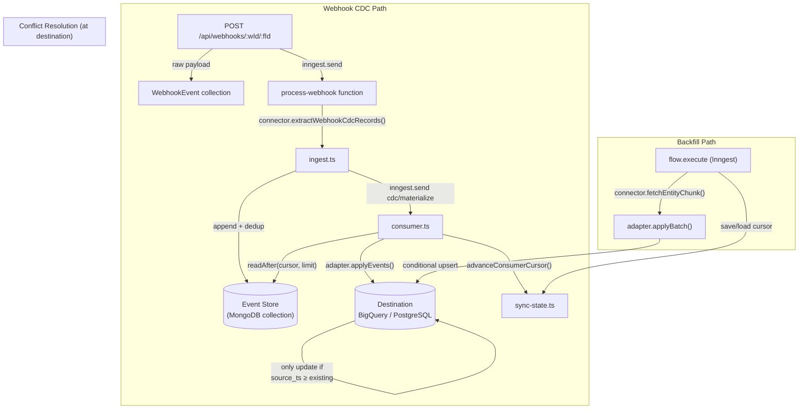
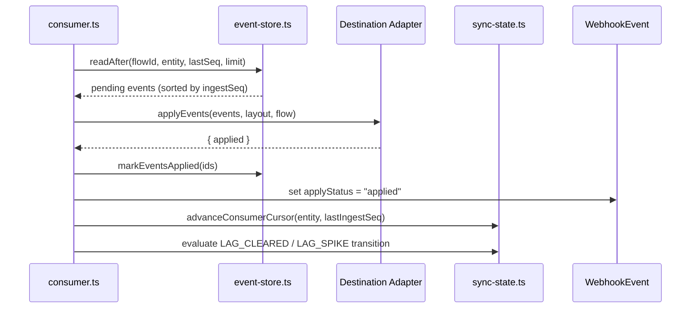
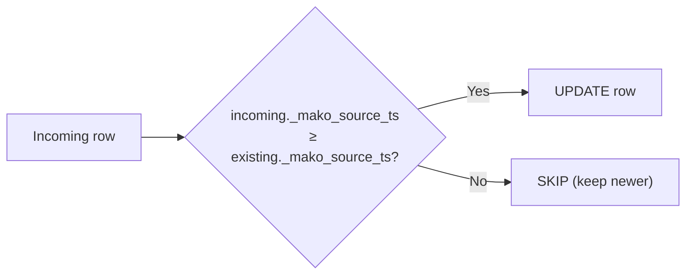
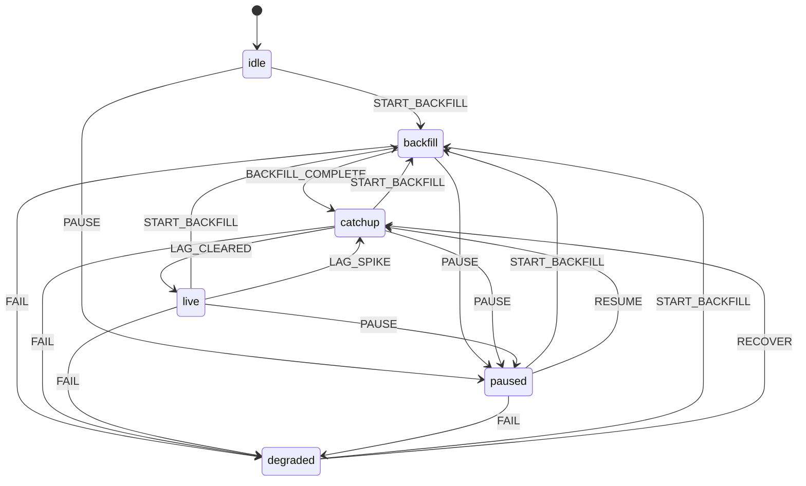

## Summary

CDC engine for syncing connector data (Close, Stripe, etc.) to SQL destinations (BigQuery, PostgreSQL) with two paths:

- **Webhook CDC** — real-time event ingestion via webhooks, consumed by a cursor-based loop
- **Direct backfill** — bulk historical sync that writes directly to the destination with no intermediary storage

Both paths can run concurrently. Conflict resolution happens at the destination using `_mako_source_ts`-guarded conditional upserts — newer data always wins regardless of processing order.

---

## Architecture

### Data flow



### Consumer loop



### Conflict resolution



- **BigQuery:** `MERGE ... WHEN MATCHED AND S._mako_source_ts >= T._mako_source_ts THEN UPDATE`
- **PostgreSQL:** `ON CONFLICT ... DO UPDATE ... WHERE EXCLUDED._mako_source_ts >= target._mako_source_ts`

### State machine

Backfill can be started from any non-backfill state. Pause/resume preserves checkpoint cursors.



---

## Delete handling

Both adapters support `soft` and `hard` delete modes (configured per flow via `deleteMode`).

| Mode | What happens | sourceTs safe | Backfill re-insert safe |
|------|-------------|:---:|:---:|
| **Soft** (recommended) | Upserts row with `is_deleted: true`, `deleted_at: now`. Row stays in destination. | Yes — guarded by `_mako_source_ts` | Yes — tombstone row has newer timestamp, backfill can't overwrite |
| **Hard** | `DELETE FROM ... WHERE id = X`. Row removed from destination. | N/A — it's a delete | No — if backfill re-processes the same record, it re-inserts because the row is gone |

**Soft delete** is the safer default. The destination row acts as a tombstone — downstream queries filter on `WHERE is_deleted = false`. A periodic cleanup job can purge soft-deleted rows after a grace period.

**Hard delete** works correctly for webhook-only flows (no concurrent backfill). During an active backfill, there's a small window where a hard-deleted row can be re-inserted by a stale backfill batch (since the target row no longer exists for the `sourceTs` guard to compare against).

---

## CDC engine (`api/src/sync-cdc/`)

| File | What it does |
|------|-------------|
| `events.ts` | CDC types, Zod schemas, `normalizeCdcEvent()` |
| `event-store.ts` | MongoDB-backed append-only event store — dedup, cursor-based reads, mark applied/failed/dropped, 7-day TTL on applied events |
| `sync-state.ts` | State transition table, guards, `applyTransition()`, backfill cursor persistence, consumer cursor advancement |
| `ingest.ts` | Webhook event ingestion — extract from connector, append to store, enqueue materialization |
| `consumer.ts` | Read-mark-advance loop — single-writer via Inngest concurrency keys, lifecycle transitions |
| `backfill.ts` | Start/pause/resume/resync/recover backfill — supports per-entity scoped backfills and checkpoint-based resume |
| `normalization.ts` | Payload key normalization, source timestamp resolution, record dedup, table name helpers |
| `entity-selection.ts` | Entity filtering from `entityLayouts` / `entityFilter` |
| `adapters/registry.ts` | `CdcDestinationAdapter` interface, factory, layout helpers |
| `adapters/bigquery.ts` | BigQuery adapter — `applyEvents` + `applyBatch` with conditional MERGE, auto table/dataset creation |
| `adapters/postgresql.ts` | PostgreSQL adapter — same interface with conditional ON CONFLICT |

---

## Observability

Single `/sync-cdc/status` endpoint (3 queries) replaces the old `/summary` + `/diagnostics` pair (15 queries, 500-event scan).

Returns: sync state, total backlog, lag, per-entity cursors (ingest seq, materialized seq, backlog, lag), and last 20 state transitions.

---

## UI: CDC panel

```
┌──────────────────────────────────────────────────┐
│ Source → Dest / dataset  📋    ↺ Reset   ✏ Edit  │
├──────────────────────────────────────────────────┤
│ ┌─────────┐ ┌───────────┐ ┌──────────────────┐  │
│ │ Stream  │ │ Backfill  │ │ Events processed │  │
│ │ [Live]  │ │ [Running] │ │ 12,450           │  │
│ │ ⏸ Pause │ │ ⏹ Stop    │ │ Last 3/22 10:30  │  │
│ └─────────┘ └───────────┘ └──────────────────┘  │
├──────────────────────────────────────────────────┤
│  Objects  │  Logs •  │  Events (142)             │
├──────────────────────────────────────────────────┤
│  (scrollable tab content)                        │
└──────────────────────────────────────────────────┘
```

**Objects tab** — Entity table: stream status, backfill status, rows written, per-entity sync button. Shows all configured entities merged with live execution stats.

**Logs tab** — Terminal-style live log stream from execution details. Shows `[entity] message (row count)`. State transition history. Dot indicator when active.

**Events tab** — Webhook events with type, processing status, apply status, received time, duration.

**Per-entity backfill** — Each entity row has a sync button. API accepts `{ entities: ["leads"] }` to scope backfill.

---

## Schema

MongoDB collections:
- `cdc_change_events` — webhook event store (7-day TTL on applied events)
- `cdc_entity_state` — per-entity cursor state + backfill cursor
- `cdc_counters` — ingest sequence counter
- `cdc_state_transitions` — audit log

Migration renames from legacy `bigquery_*` prefix, migrates checkpoint data into entity state, drops unused lock/checkpoint collections.

---

## Rollout

1. `pnpm migrate` — renames collections, migrates checkpoints, creates TTL index
2. Deploy API
3. Trigger CDC backfill on staging to verify direct writes + auto table creation
4. Confirm webhook CDC works during and after backfill
5. Verify collection renames completed
