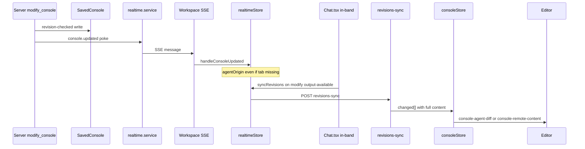

# Console sync analysis — server-side agent tools

**Date:** June 2026  
**Context:** Issue #475 moved console data tools (`modify_console`, `create_console`, etc.) to the API. The browser became "just another window" on server-authoritative drafts. Users reported that agent edits sometimes appear in the client and sometimes do not — create opens instantly, modify does nothing until refresh.

This document summarizes root-cause analysis, VM reproduction, the fix shipped on branch `cursor/console-sync-race-fix-ee9d`, and longer-term architecture recommendations.

---

## Executive summary

The bug is **deterministic**, not random. The current design is **server-authoritative drafts + workspace SSE poke + HTTP pull**, with **partial** in-band handling from the resumable chat stream. Three gaps in that pipeline explain the reported behavior:

1. **Poke-before-tab-open race** — `console.updated` pokes are dropped when the tab is not yet in `consoleStore` (common on create → immediate modify).
2. **No in-band path for `modify_console`** — unlike `create_console` / `open_console`, modify results were not handled from the chat stream; missed workspace SSE pokes left the client stale.
3. **No reconciliation after open** — `openConsoleFromServer` never called `syncRevisions`, so tabs opened with create-time content stayed stale when earlier pokes were missed.

A secondary UX issue: when SSE *does* work, agent edits often surface as an **Accept/Reject Monaco diff** (`beginAgentReview`). The store keeps the baseline until the user accepts — this can feel like "nothing happened" if the diff affordance is easy to miss.

---

## Current architecture

### Data flow (happy path)

```
Agent modify_console (API)
  → Mongo SavedConsole (draftRevision++, lastDraftOrigin: "agent")
  → publishRealtimeEvent("console.updated")  [workspace SSE poke]
  → realtimeStore.handleConsoleUpdated
  → scheduleSync (debounced 250ms)
  → POST /consoles/revisions-sync  [HTTP pull — authoritative content]
  → consoleStore.beginAgentReview | applyRemoteConsoleEntry
  → CustomEvent → Monaco (diff or silent apply)
```

### Transport layers

| Mechanism | Path | Carries content? | Used for agent edits? |
|-----------|------|------------------|------------------------|
| **Workspace SSE** | `GET /api/workspaces/:id/realtime` | No — metadata only | Primary poke channel |
| **HTTP pull** | `POST /consoles/revisions-sync` | Yes — full payloads | Authoritative apply |
| **Chat SSE** | Agent chat stream | Tool results in-band | `create_console` / `open_console` only (before fix) |
| **`chat.ui-intent` poke** | Same workspace SSE | `open_console` intent | Opens tab, no content |
| **WebSockets** | — | — | **Not used** |
| **Polling** | — | — | **Not used** (except agent `check_query_status`) |

### Key files

| Area | Path |
|------|------|
| Server tools | `api/src/agent-lib/tools/server-console-tools.ts` |
| Realtime publish | `api/src/services/realtime.service.ts` |
| SSE endpoint | `api/src/routes/realtime.ts` |
| Revisions sync | `api/src/routes/consoles.ts` |
| Client SSE + pull orchestration | `app/src/store/realtimeStore.ts` |
| Tab state + agent review | `app/src/store/consoleStore.ts` |
| In-band console open | `app/src/components/Chat.tsx` |
| Monaco bridge | `app/src/components/Editor.tsx`, `app/src/components/Console.tsx` |
| E2E harness | `scripts/realtime-e2e/` |

### Hybrid client/server state

| Layer | Owns |
|-------|------|
| **Server** | Authoritative `SavedConsole` draft, `draftRevision`, `lastDraftOrigin` |
| **Workspace SSE** | Poke hints (`console.updated`, `chat.ui-intent`, `chat.activity`) |
| **HTTP pull** | Full content via `revisions-sync` |
| **Chat stream** | In-band tool results (resumable; survives SSE drops on replay) |
| **Zustand `consoleStore`** | Tab metadata, autosave, conflict banners, agent-review baselines |
| **Monaco** | Live editor buffer (can diverge from store during typing or diff review) |

This is a workable stepping stone but relies on multiple repair layers (reconnect sync, tab-focus wake, watchdog, `lastDraftOrigin` on the server doc) because there is no single ordered event log the client reduces.

---

## Root causes (detailed)

### 1. Poke ignored when tab is not open

```typescript
// app/src/store/realtimeStore.ts (before fix)
const tab = useConsoleStore.getState().tabs[event.consoleId];
if (!tab) return; // not open in this window — nothing to update
```

**Race timeline:**

1. `create_console` completes → `chat.ui-intent` + in-band open → `openConsoleFromServer` starts async `GET /consoles/content`
2. `modify_console` completes → `console.updated` poke (rev N+1)
3. Tab still absent from store → poke **dropped**, `scheduleSync` never runs
4. `GET` returns create-time content (rev N) → tab opens stale
5. No further pokes → **stale until refresh**, reconnect, or tab focus

`handleRunCompleted` already waits up to 5s for the tab to exist before fetching run artifacts; **content pokes had no equivalent wait/retry**.

### 2. No in-band fallback for `modify_console`

`Chat.tsx` opened tabs when `create_console` / `open_console` tool results reached `output-available` in the chat stream (resumable — survives SSE drops on replay). **`modify_console` was not handled in-band** — content edits relied entirely on workspace SSE.

If workspace SSE is silently dead (NAT half-close, frozen background tab, proxy timeout without `error` event), the attached window never learns about the edit until wake/reconnect (~70s watchdog) or page refresh.

### 3. No post-open reconciliation

`openConsoleFromServer` fetched server content and opened the tab but never called `syncRevisions()`. Any pokes missed during the fetch window were not repaired.

### 4. Agent diff review can look like "no update"

When sync works, agent edits route to `beginAgentReview` → Monaco **diff mode** (Accept/Reject). The store intentionally keeps `content` and `draftRevision` on the **pre-agent baseline** until the user resolves the review. The proposed content is on the modified side of the diff.

Users expecting a silent apply may perceive this as "nothing happened" even though the edit is visible in the diff UI.

### 5. Chat history restore omits sync metadata

When restoring consoles from chat history, tabs are opened without `draftRevision` or `lastDraftOrigin`, starting from revision 0. The next `syncRevisions` should repair this, but there is a window for divergence with persisted localStorage tab content.

---

## VM reproduction

Manual e2e scenarios were added under `scripts/realtime-e2e/`. Run with the mock AI gateway and a full local stack (see `scripts/realtime-e2e/README.md`).

### Scenario results

| Scenario | What it tests | Before fix | After fix |
|----------|---------------|------------|-----------|
| `07-create-modify-same-turn` | create + modify in one agent turn | Often passed (timing-dependent) | **PASS** |
| `09-modify-live-sse` | modify in second turn, live workspace SSE | Failed in harness (editor read wrong pane in diff mode) | **PASS** |
| `08-modify-dead-sse` | Second turn modify, workspace SSE killed | **FAIL** — Monaco stuck on create content | **FAIL** (expected) |
| `08b-ui-modify-dead-sse` | Browser chat UI + dead workspace SSE | **FAIL** | **PASS** |

### Confirmed failure mode (`08-modify-dead-sse`)

- Server document holds modified content after `modify_console`
- Client Monaco still shows `SELECT 1` (create-time content)
- Page refresh shows the correct content

### Confirmed fix path (`08b-ui-modify-dead-sse`)

- Same dead workspace SSE
- User drives agent through **browser chat** (`uiAgentChat`)
- In-band `modify_console` handling triggers `syncRevisions()` → client converges

### Debug observation (live SSE, second turn)

With workspace SSE healthy, pokes **do** arrive:

```json
{
  "type": "console.updated",
  "draftRevision": 2,
  "origin": "agent"
}
```

Monaco enters diff mode with two editors (baseline + proposed). The sync pipeline works; the harness initially failed because it read the **original** editor pane, not the proposed side.

---

## Fix (branch `cursor/console-sync-race-fix-ee9d`)

| Change | Location | Why |
|--------|----------|-----|
| Track `agentOriginConsoles` **before** tab-exists check | `realtimeStore.ts` | Preserve agent routing across open race |
| `syncRevisions()` after `openConsoleFromServer` | `realtimeStore.ts` (`chat.ui-intent`), `Chat.tsx` (in-band open) | Reconcile missed pokes once tab has a revision base |
| In-band `modify_console` → `syncRevisions()` | `Chat.tsx` | Resumable chat stream backstop when workspace SSE drops |
| `chat.activity: idle` → `syncRevisions()` for active chat | `realtimeStore.ts` | Catch missed pokes at end of agent turn |

### Remaining limitation

**Detached background agent + dead workspace SSE + no chat stream attached to the window** — still stale until wake/reconnect (70s watchdog) or user focus. This is the intended tradeoff until a stronger sync model exists.

---

## Is SSE + poke-and-pull effective?

**Partially.** It works when:

- Workspace SSE is healthy
- Reconciliation runs on reconnect, tab focus, agent-turn idle, and post-open sync
- Chat-attached windows have in-band backstops for create, open, and modify

It is weak when:

- SSE silently dies mid-session (no `error` event; common with NAT and frozen tabs)
- Background agents run with no chat stream updating the browser
- Rapid create → modify races tab opening (now mitigated by post-open sync)

The design is **self-correcting** if *some* trigger eventually runs `syncRevisions`. The user experience breaks when **all** triggers are missed or delayed.

---

## Comparison: Figma, games, and the event-log model

### Figma

- **Ordered operations** appended to a document log
- Clients **reduce** operations into canvas state
- Reconnect replays from a sequence cursor
- CRDT-style merging for concurrent edits

### Multiplayer games

- **Input stream** with server authority
- Clients **predict** locally; server acks reconcile prediction errors
- Reconnect receives pending state / event backlog

### Proposed Mako model (longer term)

The intuition of **event bus + reducer** is correct:

```
client or agent → append event → server log → fanout to subscribers → clients reduce
```

- Reconnect: `GET /events?since=lastSeq`, filtered by open tabs / workspace
- State at any time = reduction of events (create, content_patch, connection_set, run_completed, …)
- WebSocket or SSE is transport; the important part is **one authoritative ordered log** with idempotent client reducers

Filter subscriptions by what the window has open (console IDs, dashboard IDs, etc.) to avoid flooding.

---

## Recommendations

### Near-term (incremental)

1. **Make agent diff review obvious** — banner or toast when `beginAgentReview` fires: *"Agent edited this console — Accept or Reject"*
2. **Lightweight sync during agent streaming** — periodic `syncRevisions()` while `chat.activity === "streaming"` on the active chat
3. **Extend in-band handling** — `run_console` result artifacts through the same chat-stream path for consistency
4. **Seed `draftRevision` on chat history restore** — avoid revision-0 tabs after session reload
5. **Run `scripts/realtime-e2e/` before merging realtime-layer changes** — not in CI today, but catches Monaco ↔ store ↔ server divergence

### Medium-term

1. **Unify repair triggers** — single `reconcileOpenConsoles(reason)` called from poke, idle, open, reconnect, focus
2. **Shorter SSE watchdog** or application-level heartbeat ack requirement for attached agent sessions
3. **Explicit "agent editing" indicator** on console tabs (like `chat.activity` for chats)

### Long-term (if reliability still insufficient)

1. **Per-entity event log** on the server (console, dashboard, app binding, …)
2. **Client reducer** per entity type; Monaco/store become projections of reduced state
3. **WebSocket** channel with tab-scoped subscriptions (or SSE with replay endpoint — transport is secondary)
4. **Detach server-side agent tools** from any assumption that workspace SSE must reach the client — treat chat stream + event log as equal citizens

---

## Related documentation

- `scripts/realtime-e2e/README.md` — e2e harness setup and scenarios
- `docs/console-streaming-improvements.md` — historical design notes (pre-#475)
- `.cursor/rules/75-chat-performance.mdc` — chat streaming performance
- Issue #475 — server-side console tools migration

---

## Appendix: poke-then-pull sequence (after fix)


