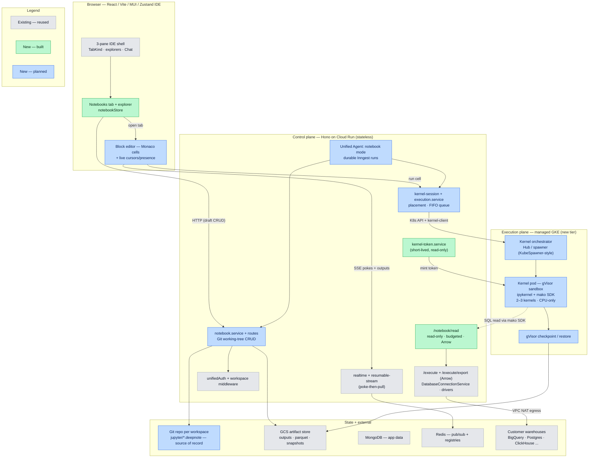
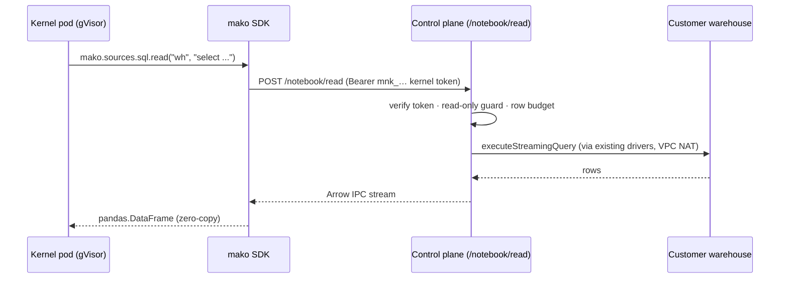
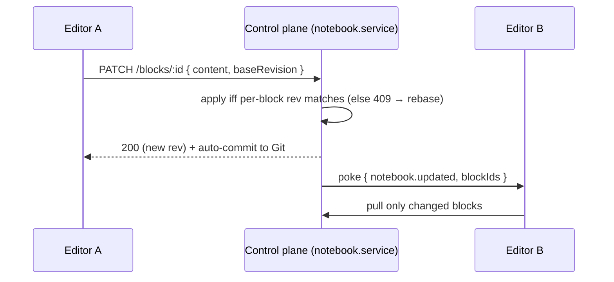

# Mako Notebooks — Target Architecture

> Status: design + early implementation (branch `feat/mako-notebooks`).
> Companion to `UNIFIED_VERSIONING_DESIGN.md`. This doc is the single visual +
> narrative reference for the Notebooks feature: what it is, which pieces are
> **reused** vs **new**, and how each technology choice buys a specific
> user-facing capability.

## 1. What it is

A **cloud, collaborative, agent-augmented Jupyter experience** inside the Mako
IDE. Business stakeholders open a notebook, write **SQL and Python** cells that
read **any Mako data source**, edit **together in real time**, and drive the
whole thing with the **Mako AI agent** — with kernels running in an isolated,
restorable compute tier that **never holds database credentials**.

The design rests on one invariant — **the disconnect test**: _if every client
disconnects right now, does the work survive?_ Document → yes (Git). Outputs →
yes (GCS). Agent runs → yes (Inngest). Kernel variables → intentionally no
(ephemeral; restored via snapshot or re-run).

---

## 2. Component map (existing vs new)

Four planes. The client is always a _view_ — nothing authoritative lives in it.
Colors: **gray = existing/reused**, **green = new & already built**,
**blue = new & planned**.



### Component inventory

| Component                                                       | Plane         | Status       | Notes                                                |
| --------------------------------------------------------------- | ------------- | ------------ | ---------------------------------------------------- |
| 3-pane IDE shell, `TabKind`, explorers, Chat                    | Client        | **Existing** | Notebooks slot in as a tab kind + explorer           |
| `DatabaseConnectionService`, drivers, `/execute/export` (Arrow) | Control       | **Existing** | Reused verbatim for reads                            |
| `realtime` + `resumable-stream` (poke-then-pull over Redis)     | Control       | **Existing** | Reused for collab pokes + exec/agent streams         |
| Unified Agent + expertise modes + `agent-skills/`               | Control       | **Existing** | Notebooks add a mode, not a fork                     |
| GCS artifact store, MongoDB, Redis                              | State         | **Existing** | Reused for outputs/snapshots, app data, coordination |
| `mako` Python SDK                                               | Client-of-API | **Built**    | `sources.sql.read → DataFrame`, read-only, Arrow     |
| `/notebook/read` + `kernel-token.service`                       | Control       | **Built**    | The one budgeted surface a kernel can reach          |
| Notebooks tab + explorer + `notebookStore`                      | Client        | **Built**    | UI shell wired through every compile-enforced map    |
| Block editor (Monaco cells, cursors)                            | Client        | **Planned**  | Slice: collaboration                                 |
| `notebook.service` + Git working-tree CRUD                      | Control       | **Planned**  | Slice: Git storage                                   |
| `kernel-session` + `execution.service` (FIFO queue)             | Control       | **Planned**  | Slice: execution plane                               |
| Kernel orchestrator + gVisor pods + checkpoint/restore          | Execution     | **Planned**  | New GKE tier                                         |
| Notebook agent mode (Inngest runs)                              | Control       | **Planned**  | Slice: agent                                         |
| Git repo per workspace (`jupyter/*.deepnote`)                   | State         | **Planned**  | Source of record; reuses dbt-Git machinery           |

---

## 3. Key data flows

**Read path — how a cell gets data without touching credentials:**



**Collaboration path — real-time without a second consistency system:**



**Execution + durability — agent/kernel work survives disconnects:**

```mermaid
sequenceDiagram
    participant UI as Client
    participant EX as execution.service
    participant ORCH as Orchestrator
    participant POD as Kernel pod
    participant RT as resumable-stream
    UI->>EX: POST /executions { blockId }
    EX->>ORCH: route to notebook's kernel
    ORCH->>POD: run cell
    POD-->>RT: stream outputs (Redis-backed)
    RT-->>UI: SSE (reconnect-safe)
    POD->>EX: final outputs → draft (small) / GCS (large)
    Note over UI,POD: client may disconnect; outputs already durable
```

---

## 4. Architecture characteristics — usability & features

**Usability**

- **Zero setup for analysts.** Config (API URL, workspace, kernel token) is injected into the kernel; a notebook just does `import mako`. No credentials, no drivers, no VPN.
- **One IDE, not a new app.** Notebooks are a tab kind beside consoles/dashboards/apps — same shell, auth, workspace, sharing, and Chat pane.
- **Close the laptop, come back.** The document and outputs are always durable; a returning session restores near-instantly (snapshot) or re-runs cheaply.
- **Git-native, Google-Docs-feel.** Continuous auto-versioning with real diffs/PRs; import/export standard `.ipynb`.

**Features**

- **Hybrid SQL + Python.** SQL cells run on the existing fast `/execute` path (no kernel spin-up) and land in the kernel as DataFrames; Python cells run on the kernel with the full analytics stack.
- **All data sources, read-only + budgeted.** Any Mako-configured warehouse, proxied through the API with SELECT-only enforcement and row/byte/time caps.
- **Real-time collaboration.** Block-level live editing, cursors, and presence — multiple editors, no lost writes.
- **Agent-augmented ("vibe notebooks").** The AI agent writes and runs cells server-side and keeps going even if the browser closes.
- **Isolated, restorable kernels.** One sandboxed pod per notebook (2–3 co-tenant, same-workspace); a runaway/OOM cell can't take down other notebooks; instant restore via memory snapshot.

---

## 5. How the technology choices enable those features

Each row: a deliberate technology choice → the capability it unlocks → the user-facing payoff.

| Technology choice                                                                  | Enables                                                                                     | User-facing payoff                                                                                |
| ---------------------------------------------------------------------------------- | ------------------------------------------------------------------------------------------- | ------------------------------------------------------------------------------------------------- |
| **Managed GKE Standard** (stateful tier, separate from Cloud Run)                  | Long-lived, sticky, horizontally-scaled sessions                                            | Notebooks that stay alive across calls (Cloud Run is stateless and can't)                         |
| **gVisor sandbox (GKE Sandbox)**                                                   | Safe execution of untrusted user/agent Python                                               | "Vibe" arbitrary code without risking the host or other tenants                                   |
| **gVisor checkpoint/restore → GCS + Redis**                                        | Memory snapshot/restore (same tech Modal uses)                                              | Near-instant session restore — variables come back, not just the doc                              |
| **2–3 kernels/pod + per-kernel cgroup/RLIMIT**                                     | Cost-efficient packing with contained blast radius                                          | Low cold-start & cost; one heavy cell can't kill a colleague's session                            |
| **`KernelProvider` interface**                                                     | Swap GKE ↔ Modal ↔ Cloud Run GPU                                                          | Not locked in; GPU/ML path reachable later without rework                                         |
| **Deepnote OSS `@deepnote/{blocks,convert,reactivity,runtime-core}`** (Apache-2.0) | Block model, `.ipynb`⇄`.deepnote` conversion, reactivity DAG, kernel-client + agent-handler | Faster build, `.ipynb` portability, stale-cell detection, agent-writes-notebook out of the box    |
| **`mako` Python SDK proxying through `/notebook/read`**                            | Reads without credentials on the kernel                                                     | Analysts query the warehouse with `import mako`; security team keeps creds server-side            |
| **Arrow IPC (`apache-arrow` / `pyarrow`)**                                         | Zero-copy columnar transport                                                                | Big result sets land as DataFrames fast, no JSON parsing                                          |
| **Short-lived HMAC kernel tokens**                                                 | Read-only, workspace-scoped, expiring credential                                            | A leaked token is near-worthless; no coarse long-lived API keys in sandboxes                      |
| **Git as system of record (1 repo/workspace, reuse dbt-Git)**                      | Real version control + diffs/PRs; source separated from outputs                             | "Versioned like Google Docs" + engineer-friendly history; notebooks live beside dbt/apps/consoles |
| **`.deepnote` YAML + fractional `sortingKey`**                                     | Diff-clean, conflict-free block ordering                                                    | Clean PRs; concurrent inserts don't clash                                                         |
| **GCS artifact store for outputs (not Git)**                                       | Large outputs by reference, DuckDB-consumable                                               | Notebook files stay small; no `.ipynb` bloat                                                      |
| **Block-granular poke-then-pull over existing Redis realtime (no Yjs v1)**         | Real-time multi-editor with one consistency system                                          | Live collaboration without the risk/complexity of a CRDT runtime                                  |
| **Server-authoritative draft + durable Inngest agent runs + resumable-stream**     | Agent + human edits share one path; work outlives the client                                | Agent builds analyses while you're offline; reconnect resumes mid-stream                          |
| **Cloud Run control plane unchanged**                                              | Reuse auth, drivers, realtime, artifact store, jobs                                         | Most of the platform is reused, not rebuilt; smaller, safer surface                               |

---
