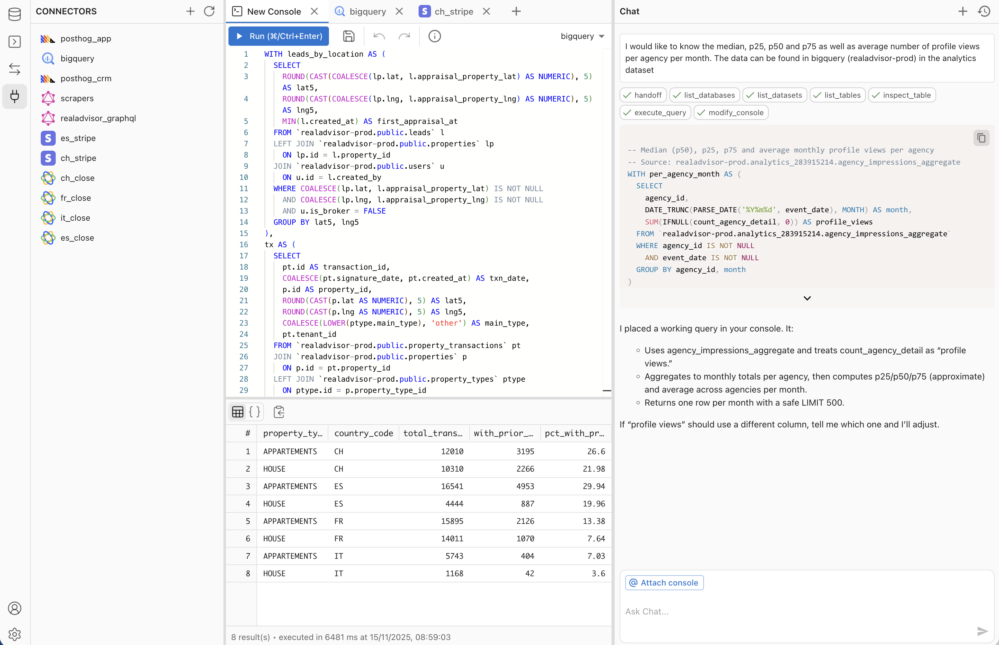
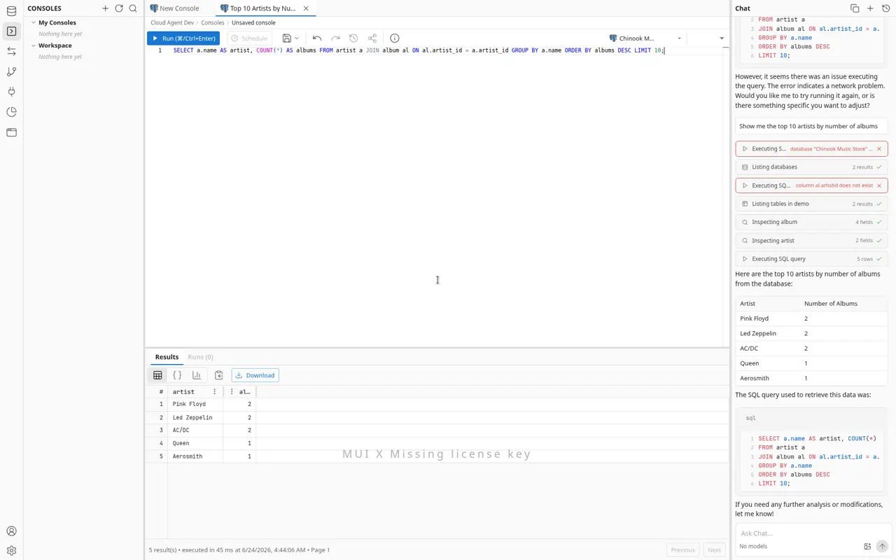
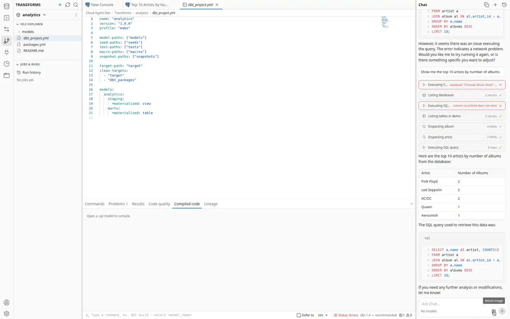
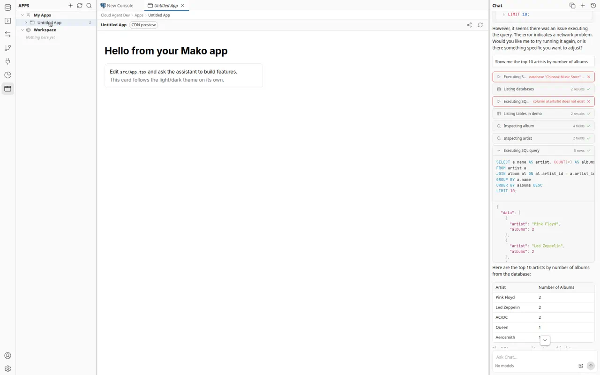

<h1 align="center">
  
  Mako
</h1>

<p align="center"><strong>The AI-native SQL Client.</strong></p>

> **The Cursor for Data.** Connect to any database, query with AI, and build live dashboards -- all from your browser.

Stop wrestling with complex SQL and slow, bloated database tools. Write queries in plain English, get instant results, and turn them into interactive dashboards with cross-filtering and scheduled refresh.



## 🚀 Why Mako?

A modern SQL client built for the AI era, replacing slow desktop tools with a fast, collaborative, AI-powered experience.

- **✨ AI Query Generation**: Write queries in natural language. Our schema-aware AI generates optimized SQL instantly.
  - _Replaces: DataGrip, DBeaver, Postico_
- **📊 AI Dashboards**: Build interactive dashboards from conversation. Cross-filtering, scheduled data refresh, Parquet materialization -- powered by DuckDB in the browser.
  - _Replaces: Metabase, Looker, manual BI pipelines_
- **🧱 dbt Transforms**: Build, run, and schedule dbt Core projects in-app -- file IDE, jobs, run history, lineage, and GitHub sync.
  - _Replaces: dbt Cloud_
- **⚛️ React Apps**: Ask the agent to build live React apps wired to your data through secure, credential-free bindings.
  - _Replaces: Lovable, v0, internal-tool builders_
- **🕓 Version History**: Every console and dashboard save is an immutable snapshot you can browse and restore.
  - _Replaces: Lost SQL files, manual backups_
- **🖥️ Mako Desktop**: Native app that bundles a local agent so `localhost` databases work out of the box.
  - _Replaces: SSH tunnels and bastion hops for local DBs_
- **👥 Team Collaboration**: Share connections, version-control queries, and work together in real-time.
  - _Replaces: Passing credentials around, lost SQL files_
- **⚡ Blazing Fast**: No Java or Electron bloat. Opens instantly in your browser and runs smooth.
  - _Replaces: Slow desktop database tools_

## 📸 Screenshots

**AI-powered console** — ask in plain English, get a verified query and live results.



**Transforms (dbt)** — build, run, and schedule dbt Core projects with a file IDE, jobs, run history, and lineage.



**Apps** — build live React apps wired to your data, rendered in a sandboxed preview.



## 🔌 Integrations

### Databases

| Integration           | Status  | Description                                          |
| --------------------- | ------- | ---------------------------------------------------- |
| **PostgreSQL**        | ✅ Live | Connect to PostgreSQL for relational data queries    |
| **MongoDB**           | ✅ Live | Connect to MongoDB for flexible document-based data  |
| **BigQuery**          | ✅ Live | Analyze large datasets with Google BigQuery          |
| **ClickHouse**        | ✅ Live | Fast OLAP queries on ClickHouse                      |
| **MySQL**             | ✅ Live | Query MySQL databases with natural language          |
| **Redshift**          | ✅ Live | Query Amazon Redshift data warehouses                |
| **Cloud SQL**         | ✅ Live | Connect to Google Cloud SQL (Postgres)               |
| **Cloudflare D1**     | ✅ Live | Query Cloudflare D1 SQLite databases                 |
| **Cloudflare KV**     | ✅ Live | Browse and query Cloudflare Workers KV               |

### Data Connectors

Sync external SaaS data into Mako's data warehouse for querying and dashboards.

| Integration    | Status  | Description                                      |
| -------------- | ------- | ------------------------------------------------ |
| **Stripe**     | ✅ Live | Track payments, subscriptions, and billing data  |
| **PostHog**    | ✅ Live | Analyze product analytics and user behavior      |
| **Close.com**  | ✅ Live | Sync CRM data (leads, opportunities, activities) |
| **Claap**      | ✅ Live | Sync recordings and workspace data               |
| **Calendly**   | ✅ Live | Sync events, invitees, and event types           |
| **GraphQL**    | ✅ Live | Query any GraphQL API with custom endpoints      |
| **REST**       | ✅ Live | Query any REST API with custom endpoints         |
| **BigQuery**   | ✅ Live | Sync BigQuery datasets into the warehouse        |

## 🏗️ Architecture

```
┌─────────────────────────────────────────────────────────┐
│  Frontend (React + Vite)                                │
│  ┌──────────┐ ┌──────────────┐ ┌─────────────────────┐ │
│  │ Console  │ │  Dashboards  │ │   AI Chat (Vercel   │ │
│  │ (Monaco) │ │  (DuckDB +   │ │    AI SDK)          │ │
│  │          │ │   Mosaic)    │ │                     │ │
│  └──────────┘ └──────────────┘ └─────────────────────┘ │
│           ▲          ▲                   ▲              │
│           │     Parquet/Arrow            │              │
│           │     via OPFS cache           │              │
└───────────┼──────────┼──────────────────┼──────────────┘
            │          │                  │
┌───────────┼──────────┼──────────────────┼──────────────┐
│  API (Hono + Node.js)                                  │
│  ┌──────────────────────────────────────────────────┐  │
│  │ Unified Agent (expertise modes: Query /          │  │
│  │   Dashboard / Sync Flow / React App / Transforms │  │
│  │   / Explore, switched via enable_mode)           │  │
│  └──────────────────────────────────────────────────┘  │
│  ┌──────────────┐ ┌───────────────┐ ┌──────────────┐  │
│  │  DB Drivers   │ │  Connectors   │ │  Dashboard   │  │
│  │  (9 drivers)  │ │  (8 sources)  │ │  Engine      │  │
│  │              │ │               │ │  (DuckDB     │  │
│  │              │ │               │ │   + Parquet) │  │
│  └──────────────┘ └───────────────┘ └──────────────┘  │
│                          ▲                             │
│                    ┌─────┴──────┐                      │
│                    │  Inngest   │ (scheduled refresh,   │
│                    │            │  incremental sync)    │
│                    └────────────┘                      │
└────────────────────────────────────────────────────────┘
            │                │
     ┌──────┴──────┐  ┌─────┴──────────┐
     │  MongoDB    │  │  User DBs      │
     │  (metadata, │  │  (PG, BQ, CH,  │
     │   warehouse)│  │   MySQL, etc.) │
     └─────────────┘  └────────────────┘
```

**Key technology choices:**
- **DuckDB** (both server-side via `@duckdb/node-api` and browser-side via `@duckdb/duckdb-wasm`): powers dashboard SQL execution, Parquet artifact generation, and in-browser cross-filtering with OPFS caching
- **Mosaic** (`@uwdata/mosaic-core`): coordinates cross-filtering across dashboard widgets
- **Apache Arrow / Parquet**: server materializes query results into Parquet, served to browser as Arrow IPC for zero-copy rendering
- **Inngest**: event-driven job queues for scheduled dashboard refresh and incremental data sync
- **Hono**: lightweight, fast HTTP framework for the API
- **Monaco Editor**: VS Code's editor for the SQL console
- **Vercel AI SDK**: multi-provider LLM abstraction (OpenAI, Anthropic, Google)

## 📊 Dashboard Engine

Dashboards are a core feature. The AI agent creates interactive dashboards from natural language:

1. **Agent creates a dashboard spec** with widgets, layouts, and SQL queries
2. **Server materializes** query results into Parquet artifacts (stored on filesystem, GCS, or S3)
3. **Browser loads** Parquet data into DuckDB-WASM, cached in OPFS for instant reloads
4. **Mosaic cross-filtering** lets users click on one chart to filter all others
5. **Inngest cron** keeps data fresh with scheduled re-materialization and stale-run detection

### Dashboard Artifact Storage

Dashboard materialization stores Parquet artifacts on the backend. Three storage backends:

- `filesystem` -- default; stores files on local disk
- `gcs` -- Google Cloud Storage
- `s3` -- S3-compatible bucket

```env
DASHBOARD_ARTIFACT_STORE=filesystem

# Optional shared settings
DASHBOARD_ARTIFACT_PREFIX=dashboards
DASHBOARD_ARTIFACT_DIR=/absolute/path/to/artifacts  # filesystem only
```

#### Google Cloud Storage

```env
DASHBOARD_ARTIFACT_STORE=gcs
GCS_DASHBOARD_BUCKET=your-bucket-name
DASHBOARD_ARTIFACT_PREFIX=dashboard-artifacts/prod
```

See the [docs](https://docs.mako.ai) for full GCS/S3 provisioning instructions.

## 🛠️ Quick Start

1. **Clone & Install**

   ```bash
   git clone https://github.com/mako-ai/mako.git
   cd mako
   pnpm install
   ```

2. **Configure Environment**
   Copy `.env.example` (if available) or create `.env`:

   ```env
   # Local development connects to the shared `dev` database, an Atlas DB that is
   # refreshed nightly from production. Grab the `dev` connection string from the
   # team vault. (`staging` backs non-migration PR previews; never point local at
   # `production`.)
   DATABASE_URL=mongodb+srv://<user>:<password>@<cluster>.mongodb.net/dev
   ENCRYPTION_KEY=your_32_character_hex_key_for_encryption
   WEB_API_PORT=8080
   BASE_URL=http://localhost:8080
   CLIENT_URL=http://localhost:5173
   ```

3. **Start Services**

   ```bash
   # Start the local notebook Python kernel so notebook `code` cells run
   # locally. Requires the KERNEL_* vars from .env.example in your .env.
   # (The dev database is hosted MongoDB Atlas, set via DATABASE_URL.)
   pnpm run docker:up

   # Start the full stack (API + App + Inngest)
   pnpm run dev
   ```

4. **Analyze**
   - Open **http://localhost:5173** to access the app.
   - Add a Data Source (e.g., Stripe or Close.com).
   - Use the chat interface to ask questions about your data.

## 🌐 IP Whitelisting

If your database requires IP whitelisting, add the following static IP to your allowlist:

```
34.79.190.46
```

This IP is used by Mako's cloud service for all outbound database connections.

## 💻 Development Commands

| Command                 | Description                                                   |
| ----------------------- | ------------------------------------------------------------- |
| `pnpm run dev`          | Start API, frontend, and Inngest dev server                   |
| `pnpm run app:dev:scan` | Start the frontend with React Scan and render debug logging   |
| `pnpm run migrate`      | Run database migrations                                       |
| `pnpm run docker:up`    | Start the local notebook Python kernel (run notebook code cells) |
| `pnpm run test`         | Run test suite                                                |
| `pnpm run build`        | Build all packages                                            |
| `pnpm run docs:dev`     | Start documentation site locally                              |

## 🔎 React Performance Profiling

Use React Scan when working on render churn, streaming chat responsiveness, Monaco console performance, or explorer/result table interactions:

```bash
pnpm run app:dev:scan
```

This enables the React Scan Vite plugin via `VITE_REACT_SCAN=true` and turns on Mako's render-debug logs via `VITE_RENDER_DEBUG=true`. React Scan highlights components that re-render in the browser, while render-debug logs summarize why hot components such as `Chat`, `ResourceTree`, `Console`, and `ResultsTable` changed.

Keep React Scan off during normal development. The plugin and debug hooks are gated behind env flags so regular `pnpm run app:dev` runs without profiling overlays or extra debug logging.

## 🤝 Community & Support

- **Documentation**: [docs.mako.ai](https://docs.mako.ai)
- **GitHub**: [mako-ai/mako](https://github.com/mako-ai/mako)
- **Website**: [mako.ai](https://mako.ai)

---

<p align="center">
  Built with ❤️ by the Mako Team. Open Source and self-hostable.
</p>
