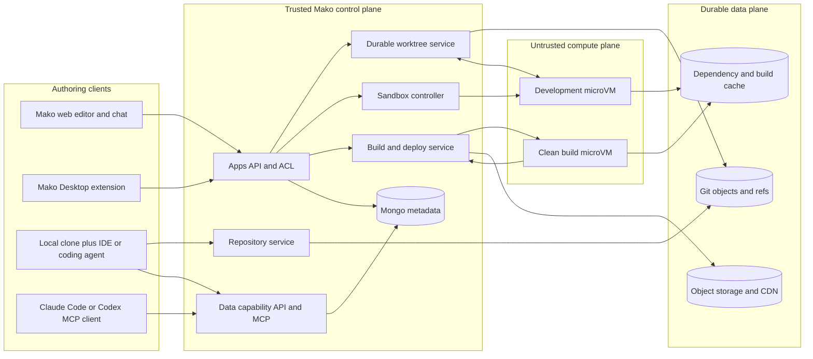

# Apps v2: Git-native projects, real development environments, and instant deployment

- **Status:** Proposed; initial Git-native backend slice implemented behind
  `APPS_V2_ENABLED=false` by default
- **Production gate:** enabling also requires a durable non-temporary Git root
  and `APPS_V2_GIT_DURABILITY_CONFIRMED=true`
- **Audience:** Product, application platform, agent, data platform, security, and desktop teams
- **Last updated:** 2026-07-11
- **Scope:** Mako Apps authoring, storage, preview, deployment, and external coding-tool access

## Executive summary

Apps v2 should make every Mako app a normal React project:

- a real POSIX filesystem;
- a standard `package.json` and checked-in lockfile;
- a real shell in an isolated Linux environment;
- a standard Git remote that can be cloned and edited with any coding tool;
- a reproducible build that produces an immutable deployment; and
- a published `@mako/app-sdk` that preserves Mako's differentiated, credential-free access to workspace data.

The central architectural decision is to keep three concerns separate:

1. **Git is durable source history.** Commits, branches, tags, and release revisions live in a real repository.
2. **A Mako worktree service is durable draft state.** It snapshots committed, modified, and untracked source files independently of any sandbox. It is the source queried by the Mako file explorer.
3. **Sandboxes are replaceable compute.** They provide the filesystem view, shell, package manager, build processes, and preview server, but they are never the sole owner of user work.

This separation is necessary even when the selected sandbox vendor offers pause/resume or persistent disks. Vendor persistence is useful for warm starts and dependency caches, not as the system of record.

The recommended v1 topology is **one Mako-managed repository per app**, under a workspace namespace. This preserves app-level access control, makes cloning and deployment understandable, and limits blast radius. Customer-owned monorepositories require a later RFC because a subdirectory is not an authorization boundary. Existing dbt repositories remain separate.

The first production runtime should remain deliberately narrow: Apps v2 builds static client applications with Vite-compatible tooling and deploys immutable assets to a dedicated app origin. Arbitrary scripts may run during development and builds, but Apps v2 does not initially host arbitrary long-running backend processes.

## Decision summary

| Question                                                   | Decision                                                                                                                                                                                        |
| ---------------------------------------------------------- | ----------------------------------------------------------------------------------------------------------------------------------------------------------------------------------------------- |
| How does the agent get a filesystem and shell?             | A provider-abstracted, hardware-isolated Linux sandbox per active worktree. Start with an E2B proof of concept, but do not couple persistence or APIs to E2B.                                   |
| What survives a sandbox loss?                              | Git commits plus private, compare-and-swap WIP state in the Mako repository service. Sandboxes and `node_modules` are reconstructible caches.                                                   |
| What does the file explorer read?                          | A Mako Worktree API backed by the durable WIP revision, never a sandbox filesystem directly.                                                                                                    |
| Can a persistent filesystem be mounted?                    | Yes, as an optimization. It must not replace Git/WIP snapshots, and `node_modules`/build caches should be separate from source.                                                                 |
| How are dependencies installed?                            | `pnpm install` in the sandbox, with `package.json`, `pnpm-lock.yaml`, a pinned package manager, quotas, and controlled egress.                                                                  |
| How are apps hosted?                                       | Clean build in a fresh sandbox; immutable static output in object storage/CDN; an origin on a registrable domain unrelated to `mako.ai`; deployment points to a commit SHA and artifact digest. |
| How does a local checkout reach Mako data?                 | `@mako/app-sdk` plus `mako dev`, authenticated by OAuth 2.1 Authorization Code + PKCE. The local proxy holds tokens; app code receives only short-lived capabilities and query results.         |
| How do Claude Code and Codex use Mako's data intelligence? | A remote, OAuth-protected Mako MCP server for schema discovery and read-only query tools, plus ordinary Git and local filesystem access.                                                        |
| How many repositories?                                     | One Mako-managed repository per app in v1. Do not put all workspace apps, dbt projects, and consoles in one repository. External monorepos require a later, separately approved design.         |
| What remains in MongoDB?                                   | Product metadata, ACLs, repo/worktree/deployment records, binding projections, build status, and audit events—not source file contents.                                                         |

## Product thesis and USP

The refactor is not valuable merely because "coding tools use a shell." The shell is an enabling capability. Apps v2 succeeds only if it combines normal software development ergonomics with Mako's two unique advantages:

1. **Data advantage:** immediate, governed access to every workspace data source, schema, saved query, dbt environment, and materialized dataset without exposing database credentials.
2. **Delivery advantage:** a working preview and production deployment without the user operating infrastructure.

A local clone plus Claude Code already provides excellent file editing, package installation, tests, and Git. Mako must not build an inferior imitation. Mako should provide the remote data plane, deployment plane, collaborative worktree, and in-product agent while letting the user choose the coding harness.

## Why change

### Problems in the current authoring model

The current Apps model is a MongoDB document containing:

- a virtual `files` array;
- a dependency name-to-version map;
- data bindings;
- a draft and a copied `published` snapshot.

The shared schema states this directly in `packages/schemas/src/app.schema.ts`. New apps contain only `src/App.tsx` and `README.md`; dependencies are metadata rather than a `package.json` (`packages/schemas/src/app-scaffold.ts`).

That model has the following limits:

- no directories or filesystem semantics beyond normalized path strings;
- no shell, package-manager/process harness, or real filesystem, although server-side app tools already provide headless virtual-file CRUD;
- no `package.json`, scripts, dev dependencies, lockfile, or package manager;
- no local build, test, lint, code generation, or framework CLI;
- no ordinary Git clone, branch, merge, diff, or pull request;
- no way to edit naturally with Claude Code, Codex, Cursor, or another IDE;
- browser-side Babel and CDN module resolution rather than a reproducible build;
- the agent can edit headlessly, but rendered preview inspection and runtime-error feedback require an attached browser;
- application source, mutable product metadata, and deployment state are coupled in one MongoDB document.

The current CDN runtime is useful for zero-install prototypes and should be retained temporarily as a migration/fallback renderer. It is not the foundation for Apps v2.

### Problems this RFC does not attribute to MongoDB alone

Moving file blobs from MongoDB to Git does not create a development environment. Git does not preserve uncommitted work, run commands, install packages, serve previews, authorize data access, or deploy applications. A complete design needs a worktree layer, isolated compute, a build service, and a runtime data SDK.

Similarly, a sandbox with a persistent disk is not a collaboration or version-control system. If the sandbox ID is deleted, a provider has an outage, or concurrent sessions edit the same tree, relying on that disk alone produces data-loss and consistency risks.

## Current architecture

### Apps

The current flow is:

1. `MakoApp` stores draft files, dependencies, bindings, and published content in MongoDB (`api/src/database/workspace-schema.ts`).
2. REST routes in `api/src/routes/apps.ts` read and mutate the document.
3. Server app tools in `api/src/agent-lib/tools/server-app-tools.ts` already provide headless create/read/write/move/delete, binding, materialization, and version operations against the same document.
4. `app/src/store/appStore.ts` autosaves file and binding changes; `app/src/components/AppsExplorer.tsx` renders its file tree from that Mongo-backed store, not from a sandbox.
5. `app/src/app-runtime/preview.ts` builds an `about:srcdoc` document, loads Babel from unpkg, resolves dependencies from esm.sh, and injects `@mako/app-sdk`.
6. `app/src/components/AppRenderer.tsx` runs that document in an opaque-origin iframe and mediates data access with `postMessage`.
7. Saving a version copies the draft into `EntityVersion` and `published`; public views always read the published copy.
8. Live bindings execute through the workspace-scoped API. Parquet bindings reuse the dashboard materialization and DuckDB-WASM pipeline.

Server-authoritative mutations emit realtime invalidations so open clients refetch current state. Apps v2 should preserve that poke-then-pull pattern while replacing the Mongo document with revisioned Worktree state.

The schema contains a planned `webcontainer` runtime enum, but no WebContainer executor exists; preview always uses the CDN path. Apps v2 supersedes that in-browser plan with cloud-isolated Linux sandboxes because local Git, external harnesses, server-controlled recovery, and build parity are requirements. The legacy enum remains migration-only and should eventually be removed.

Important behavior to preserve:

- database credentials never enter app code;
- published viewers never see a partially edited draft;
- private/workspace ACLs apply to Apps;
- binding definitions are revisioned with the app;
- public live queries are explicit, read-only, and rate-limited;
- dbt-linked bindings can resolve a per-user preview environment while production uses the prod-like environment;
- Mako can inspect schema and data before generating UI code;
- previews are embedded in Mako while public apps can be opened directly.

### dbt and Git

The existing dbt module does not mount or clone a durable Git working tree. It implements a MongoDB virtual filesystem:

- `DbtFile` is the branch base;
- `DbtFileDraft` is a per-user, per-branch overlay;
- `DbtCheckout` tracks the user's branch;
- GitHub's Git Data API synchronizes committed trees;
- the dbt runner materializes files to a temporary directory only for execution.

The relevant code is in:

- `api/src/dbt/dbt-working-tree.service.ts`;
- `api/src/dbt/dbt-github-sync.service.ts`;
- `api/src/dbt/dbt-github-git.service.ts`;
- `api/src/integrations/github/`; and
- `api/src/dbt/runner.service.ts`.

Apps v2 should reuse GitHub App authentication, provider API primitives, RBAC patterns, realtime invalidation, and execution materialization lessons. It should not copy dbt's MongoDB virtual filesystem or dbt-specific file filters and branch policy.

### Desktop and local agent

Mako Desktop is a thin Electron shell around the web application and starts `packages/local-agent`. The Local Agent can also run standalone without Desktop. It:

- listens on `127.0.0.1:41720`;
- stores local connection credentials under the OS user account;
- exposes database tree and execute APIs;
- is used by console and schema flows for `local_*` connections; and
- does not provide a shell or Apps runtime.

Apps bindings indirectly reject `local_*` connection IDs because validation requires a workspace `DatabaseConnection` MongoDB ObjectId, and Apps execution always uses the cloud path. Mako currently has routes and OAuth state for configuring external MCP servers, but acts as an MCP client; it does not expose a Mako data MCP resource server.

Workspace API keys can query cloud-reachable connections, but they are long-lived credentials and are not the recommended developer login or browser runtime mechanism for Apps v2.

Desktop auth already supplies a useful precedent—short-lived, one-time PKCE-style handoff codes in `api/src/auth/desktop-auth.ts`—but it is not a general OAuth authorization server and cannot directly authenticate CLI/MCP/runtime clients.

### Hosting

The Mako product is currently a Vite SPA and Hono API in one Cloud Run image, fronted by Cloudflare routing. "Publishing" an App does not build or deploy a separate project; it changes the MongoDB snapshot served by Mako's public share route.

Apps v2 therefore requires a new build and asset-hosting plane. The existing application deployment pipeline is not a per-user app deployment system.

## Goals

### Product goals

1. Let the Mako agent build and debug apps with the same basic primitives available to modern coding agents: files, shell, package manager, scripts, tests, and process output.
2. Let users clone an app and edit it with any local IDE or coding agent.
3. Preserve secure, workspace-scoped data access without revealing connection credentials.
4. Preserve one-click preview, publish, rollback, and public sharing.
5. Make builds reproducible and deployments immutable.
6. Recover all acknowledged source edits after sandbox loss.
7. Support normal Git workflows without forcing users to understand Mako's internal draft storage.
8. Keep the architecture open to future ad-hoc data scripts without granting broad database credentials to untrusted sandboxes.

### Agent goals

The in-product agent must be able to:

- inspect a real tree;
- read, create, move, and delete files;
- run non-interactive and interactive shell commands;
- install packages through the selected package manager;
- run dev servers, tests, linters, and builds;
- receive structured exit codes, stdout, stderr, and process lifecycle events;
- inspect the rendered preview and browser console;
- access Mako schema/query tools outside the shell;
- checkpoint or commit work; and
- recover its worktree after sandbox replacement.

### Non-functional goals

- No acknowledged eligible Worktree state from a Worktree API mutation or completed finite command is lost when a sandbox disappears; excluded/ignored changes are reported explicitly.
- Interactive terminal/background-process changes have a visible durability watermark and a maximum two-second recovery-point objective; publish and sandbox stop force a durable flush.
- Preview is available from a cold project without manual setup.
- Publish output is content-addressed and can be rolled back without rebuilding.
- Tenant code never runs in the Mako API process.
- Tenant code cannot read Mako service credentials or another tenant's files.
- Database credentials never enter the project repository, build environment, browser bundle, or sandbox.
- Every data request is attributable to workspace, user/service principal, app, revision/deployment, binding, and environment.
- Repository and deployment access follows app ACLs.
- The system supports quotas for CPU, memory, disk, process count, command duration, build duration, artifact size, and network transfer.

## Non-goals for the first release

- Hosting arbitrary user backend servers, cron processes, queues, or serverless functions.
- Giving deployed browser code arbitrary SQL execution.
- Making Mako a general-purpose cloud IDE.
- Persisting `node_modules`, compiler caches, or build output as source.
- Making local uncommitted files visible to Mako without an explicit sync process.
- Combining all workspace resources into a single repository.
- Supporting every package manager and framework on day one.
- Allowing write queries or data manipulation without a separate permission and approval model.
- Replacing the existing Local Agent's database-connection role.

## Recommended architecture

### System overview



### Trust boundary

The API, repository authorization, worktree coordinator, data capability service, and deploy controller are trusted. User code, package lifecycle scripts, build scripts, dev servers, and agent-authored shell commands are untrusted.

The trusted control plane must never execute a user-provided command. It sends an argv/process request to an isolated compute plane and receives structured results.

### Session executor seam

Apps v2 must not equate "development session" with "cloud sandbox." A
provider-neutral `SessionExecutor` sits above `SandboxProvider` and exposes the
same worktree-aware contract to every harness:

- `prepare` and `applyRevision`;
- `exec`, `spawn`, `stdin`, `signal`, and `logs`;
- `captureEligibleState` and `flush`;
- `exposePreview`; and
- `close`.

Each request carries app, worktree, lease epoch, durable revision, purpose
(`interactive`, `build`, or future `job`), policy profile, and cancellation.
Implementations are:

- `CloudSessionExecutor`, backed by the selected isolated sandbox provider;
- `LocalSessionExecutor`, implemented later by the CLI/Desktop local agent
  against an explicitly linked checkout; and
- `FakeSessionExecutor`, used by conformance and agent-tool tests.

The Worktree service remains the durability authority in every case. This gives
browser users safe cloud compute while allowing Desktop and terminal users to
run on their own machine without consuming sandbox minutes or creating a second
storage model.

### Project layout

A new Apps v2 project should use a familiar Vite-compatible scaffold:

```text
.
├── .gitignore
├── .mako/
│   └── app.yaml
├── README.md
├── package.json
├── pnpm-lock.yaml
├── index.html
├── src/
│   ├── App.tsx
│   ├── main.tsx
│   └── styles.css
├── public/
└── vite.config.ts
```

`package.json` should include:

- `packageManager` pinned to an exact pnpm version (and integrity when Corepack supports it);
- `dev`, `build`, `typecheck`, and `lint` scripts;
- `@mako/app-sdk` as a normal dependency; and
- React/Vite dependencies owned by the project rather than injected by the host.

The initial backend scaffold intentionally omits `@mako/app-sdk` until that
package is published; adding a nonexistent dependency would make generated
projects impossible to install. The SDK is added when its package is available.

`.mako/app.yaml` is checked in and contains non-secret deployment and data-binding configuration:

```yaml
schemaVersion: 1
build:
  command: pnpm build
  outputDirectory: dist
bindings:
  - id: revenue_v1
    name: revenue
    language: sql
    queryFile: queries/revenue.sql
    materialization: parquet
    schedule:
      cron: "0 * * * *"
      timezone: UTC
      freshnessTtlMs: 3600000
```

Queries may be inline initially, but query files are preferable because they receive normal diff, blame, and editor behavior. Binding IDs are stable across renames. The complete schema must also represent `dbtProjectId`, database selection, schedules, materialization policy, and requested public-live policy supported by the current model; effective public approval remains control-plane state.

Environment-specific targets do not belong in portable source. Mako stores the mapping from logical binding ID to workspace connection, database, dbt environment, and local preview override in control-plane records. This allows a fork or workspace transfer to remap data without editing source.

Mako maintains a validated MongoDB projection keyed by `(appId, Git SHA or WIP OID, manifest digest, environment-mapping revision)` for indexing, scheduling, ACL checks, and materialization. Environment mappings are immutable revisions; every preview/deployment pins one mapping revision and changing a target creates a new revision rather than silently retargeting history. Runtime execution fails closed unless that exact projection exists. Git is authoritative for portable manifest/query content; the pinned server projection is authoritative for environment-specific resource mappings.

## Source control and repository topology

### Default: one repository per app

Every Mako-managed app receives a standard Git remote such as:

```text
https://git.mako.ai/<workspace-slug>/<app-slug>.git
```

Reasons:

- current Apps can be private or workspace-visible; a workspace mega-repo cannot enforce app-level visibility;
- deployment, rollback, deletion, transfer, and audit naturally operate on one app;
- local users clone only what they need;
- dependency graphs and lockfiles remain independent;
- branch and merge activity on one app does not disrupt every other app;
- repository size and agent context remain bounded;
- a compromised package or accidental secret has a smaller blast radius.

Fewer repositories do not automatically make an agent smarter. Unrelated source consumes context and increases search noise. Mako should provide cross-resource context through schema, dbt, console, and app MCP tools rather than by placing every resource in the same directory.

### External and monorepo support

External repositories are deferred from v1. A sparse checkout or repository subdirectory is not an authorization boundary: anyone who can clone the repository can read its other Git objects, and Mako cannot impose app ACLs on direct GitHub access.

A later RFC may allow a customer-owned repository/subdirectory only after defining repository-wide authorization, build context, workspace dependencies, branch protection, webhook authority, and where private WIP lives. WIP refs must never be written to a customer repository. Until then, users can copy or subtree their Mako app into another monorepo explicitly, but it is not a synchronized product mode.

### dbt and consoles

- Keep each dbt project's existing repository binding. dbt projects often predate Mako and have distinct CI, review, and warehouse permissions.
- Do not copy dbt source into an app repository.
- Reference dbt models and environments by Mako resource ID through bindings and MCP.
- Keep consoles in their current product store initially. A later "workspace code" export can represent selected consoles as `.sql` files, but it should not block Apps v2.

### Repository service

Mako needs a standard Git Smart HTTP remote so ordinary `git clone`, fetch, and push work. Do not implement Git's wire protocol in the Apps API.

Use a proven Git service or library with:

- content-addressed objects/packfiles in durable storage;
- transactional, strongly consistent ref updates;
- app-level authorization delegated to Mako;
- short-lived OAuth/PAT credentials for command-line Git;
- repository quotas, garbage collection, backups, and audit logs; and
- webhook/event emission for ref changes.

Before implementation, a focused ADR must select the service and prove Smart HTTP auth integration, strong ref compare-and-swap, encrypted backup/restore targets, repository deletion/retention, quotas, garbage collection, abuse controls, branch protection, and force-push policy. Git LFS and submodules are unsupported in v1.

Mako should have a managed remote by default so app creation does not require GitHub. An external mirror is not part of v1.

## Durable worktrees and uncommitted state

### Why Git alone is insufficient

Git only knows content that has been written into objects and reachable refs. A modified or untracked local file is not durable in a remote repository. Apps v2 must explicitly snapshot WIP state.

### Worktree model

Each active editor/agent gets an `AppWorktree`:

```text
AppWorktree
  id
  appId
  actorId
  branch
  baseCommitSha
  wipRef
  wipOid
  revision
  sandboxLeaseId?
  leaseEpoch
  durableWatermark
  lastSyncedAt
  status
```

`wipRef` is a private service ref such as:

```text
refs/mako/worktrees/<worktree-id>
```

The ref is not advertised by Smart HTTP, cannot be fetched by repository collaborators, is denied by upload-pack `hideRefs`/arbitrary-object-want policy, and is never mirrored externally. Only the Worktree service principal may read or update it.

Its target is a versioned WIP state object, not merely a tree commit. It records:

- the visible base commit SHA;
- the complete worktree tree excluding ignored/cache paths;
- the serialized index, including conflict stages 1/2/3;
- sandbox-local refs and every newly reachable Git object;
- executable modes, deletes, renames, and supported file metadata;
- a monotonic worktree revision;
- a fencing `leaseEpoch`;
- actor/session metadata; and
- the previous WIP OID for recovery/audit.

This format preserves a sandbox-local `git commit` and an unresolved merge. Restoration reconstructs `HEAD`, local refs, index stages, and worktree separately. A plain `git write-tree` is insufficient because it fails for an unmerged index.

The repository service validates uploaded objects with quarantine/fsck before promotion. WIP state maintains structural GC roots or explicit reachability leases for every referenced local commit/tree/blob; serializing an OID inside an ordinary blob is not considered reachability. Removing a WIP ref releases those roots only after the retention window.

The WIP ref compare-and-swap is the transaction authority. Every mutation carries `(worktreeId, leaseEpoch, expectedWipOid)`. Updating the WIP ref from the expected OID to the new state OID is the commit point; MongoDB revision/status and realtime events are repairable projections. A stale sandbox epoch or OID is rejected and preserved on a conflict ref for recovery.

Only one fenced mutation stream owns a worktree at a time. Worktree API writes are routed through the active lease, not applied concurrently beside sandbox writes. Reassigning a sandbox increments `leaseEpoch`, so delayed snapshots from the old sandbox cannot overwrite newer state.

Old WIP states have an explicit retention and garbage-collection policy. Published commits and deployment refs never expire. Workspace deletion, legal hold, export, repository backup, and disaster-recovery RPO/RTO are defined in the repository ADR.

### Mutation acknowledgement

A Worktree API write or finite agent shell command is acknowledged as durable for **eligible project state** only after:

1. the command has completed or the file has been written in the sandbox;
2. changed paths have been captured;
3. the complete Git state has been uploaded through the trusted Git broker;
4. the private WIP ref has advanced with compare-and-swap; and
5. the durable watermark has been returned.

Realtime events are emitted after acknowledgement but are not part of the transaction.

Eligible state includes tracked files, untracked non-ignored files within project limits, local refs, and the Git index. Ignored caches, `.env*`, secrets, files outside the project root, sockets/devices, and over-limit files are excluded. A completed command that changed excluded paths reports them explicitly before durable acknowledgement; those paths are never promised to survive.

For long-running dev servers and interactive terminals, a provider/control agent outside the tenant process namespace batches filesystem changes and advances the durable watermark at least every two seconds. Tenant commands run as an unprivileged UID with no sudo, Linux capabilities, access to the control agent, or ability to impersonate its channel; provider conformance tests verify that boundary. The terminal displays `syncing`, `durable at <revision>`, or `sync failed`; it must not imply that keystrokes are synchronously durable. Before publish, stop, lease transfer, or a reported clean prompt after a finite command, the controller forces a flush. The accepted interactive recovery-point objective is two seconds; a future synchronous journal/FUSE design can reduce it to zero.

If filesystem events overflow or the sidecar reconnects, it performs a full manifest reconciliation rather than assuming the event stream is complete.

### Sandbox recovery

When a sandbox is missing:

1. create a fresh sandbox from the approved base image;
2. have the trusted Git broker materialize repository objects at `baseCommitSha` without placing a Git credential in the guest;
3. read the private WIP state through the Worktree service;
4. reconstruct local refs, index/conflict stages, and worktree while preserving `git status`;
5. restore dependency caches keyed by OS, runtime, and lockfile hash;
6. run `pnpm install --frozen-lockfile` when needed;
7. restart the dev server; and
8. reconnect preview, terminal, and agent streams.

No source correctness depends on the old sandbox resuming successfully.

### Local uncommitted work

Mako cannot observe files that exist only on a user's laptop. The contract must be explicit:

- a normal `git push` updates remote committed state;
- `mako dev --sync` or the Mako IDE extension can mirror local WIP to a selected Mako worktree;
- without sync, Mako preview/deploy remains on the latest pushed or Mako-authored revision;
- Mako never silently uploads an arbitrary local repository.

The sync protocol uses file manifests, content hashes, ignore rules, and compare-and-swap revisions. It does not grant the cloud sandbox access to the user's home directory.

## File explorer and editing API

The file explorer must not call E2B, Vercel, Daytona, or another sandbox vendor directly. It queries the durable worktree service:

```text
GET    /api/workspaces/:workspaceId/apps/:appId/worktrees/:worktreeId/tree
GET    /api/workspaces/:workspaceId/apps/:appId/worktrees/:worktreeId/files/:path
PUT    /api/workspaces/:workspaceId/apps/:appId/worktrees/:worktreeId/files/:path
DELETE /api/workspaces/:workspaceId/apps/:appId/worktrees/:worktreeId/files/:path
POST   /api/workspaces/:workspaceId/apps/:appId/worktrees/:worktreeId/move
GET    /api/workspaces/:workspaceId/apps/:appId/worktrees/:worktreeId/status
POST   /api/workspaces/:workspaceId/apps/:appId/worktrees/:worktreeId/commit
POST   /api/workspaces/:workspaceId/apps/:appId/worktrees/:worktreeId/discard
```

Writes include `ifRevision`/`expectedWipOid` and the current lease epoch. A stale value returns `409` with changed paths; it never silently overwrites another revision.

The response includes:

- tree entries and content hashes;
- Git status (`added`, `modified`, `deleted`, `renamed`, `untracked`);
- branch and base SHA;
- durable worktree revision;
- active sandbox/preview state; and
- conflict state.

Realtime events are invalidations, not payload authority. Clients receive the new revision and refetch affected paths, matching the existing Mako poke-then-pull pattern.

All paths are canonical POSIX-relative paths. The API rejects absolute paths, `..`, NULs, `.git` mutations, case-colliding names, device files, FIFOs, sockets, and symlinks in v1. It preserves executable file modes, supports UTF-8 text plus streamed binary assets, and enforces per-file, file-count, and aggregate-worktree limits.

## Sandbox and shell architecture

### Required isolation

Package installation runs lifecycle scripts, and arbitrary shell access can execute any downloaded binary. Multi-tenant tenant code therefore requires a microVM or equivalent hardware-isolated boundary, not a process in the API container.

Every development or build sandbox must have:

- a tenant/worktree-specific identity;
- no host filesystem mounts;
- no cloud metadata endpoint;
- no Mako service account;
- no database credentials;
- CPU, memory, disk, process, and time limits;
- egress policy at the network/proxy layer;
- authenticated preview port exposure;
- complete lifecycle/audit events; and
- destruction/revocation on access loss.

### Provider abstraction

Define a narrow `SandboxProvider` owned by Mako:

```ts
interface SandboxProvider {
  create(input: SandboxSpec): Promise<SandboxHandle>;
  exec(id: string, command: ExecSpec): Promise<ExecHandle>;
  readFile(id: string, path: string): Promise<Uint8Array>;
  writeFile(id: string, path: string, data: Uint8Array): Promise<void>;
  exposePort(
    id: string,
    port: number,
    policy: PortPolicy,
  ): Promise<PreviewHandle>;
  snapshot(id: string): Promise<SandboxSnapshot>;
  stop(id: string): Promise<void>;
  destroy(id: string): Promise<void>;
}
```

Mako-specific Git, WIP, auth, and data behavior sits above this interface.

### Vendor recommendation

Run a production proof of concept with **E2B** first because its API is designed around coding-agent files, commands, process streams, previews, templates, network policy, pause/resume, and snapshots. Its current persistent volumes are private beta, so Apps v2 must not require them.

Benchmark at least one fallback:

| Option                       | Strength                                                    | Concern / role                                                                            |
| ---------------------------- | ----------------------------------------------------------- | ----------------------------------------------------------------------------------------- |
| E2B                          | Coding-agent API, network controls, pause/resume, snapshots | Persistent volumes are beta; vendor snapshots remain cache/recovery aids, not authority   |
| Vercel Sandbox               | Persistent-by-default filesystem snapshots and clean SDK    | Validate networking, regional fit, quotas, and economics for long interactive sessions    |
| Daytona                      | Persistent S3-backed FUSE volumes and self-host option      | Volume concurrency is last-writer-wins; validate isolation and operational burden         |
| Cloudflare Sandbox           | Strong platform integration and S3-compatible mounts        | Container filesystem is discarded on sleep; do not make its container state authoritative |
| Self-hosted Firecracker/Kata | Maximum control and GCP placement                           | Highest security and operational burden; defer until scale or compliance requires it      |

The selection gate must test:

- isolation and independent security review;
- cold and warm start latency;
- terminal/process streaming;
- filesystem event reliability;
- package-install performance;
- authenticated port forwarding;
- egress allow/deny controls;
- maximum session and snapshot lifetime;
- region/data residency;
- per-minute and storage economics;
- quotas and abuse controls; and
- export/recovery behavior during provider outage.

### Persistent volume policy

A provider volume may hold a warm checkout or tenant-scoped dependency cache, but it is an optimization behind the sandbox adapter:

- source durability still comes from branch refs plus private WIP state;
- the fenced worktree lease prevents concurrent writers to one mounted source tree;
- FUSE/object-store mounts are not assumed to provide Git-grade locking or atomic rename semantics;
- shared caches are read-only and integrity-verified;
- losing or corrupting the volume triggers reconstruction, not data loss; and
- the file explorer never reads the volume directly.

### Shell API

Expose structured process primitives rather than one opaque shell string:

- `exec(argv, cwd, envRefs, timeout)`;
- `spawn(argv, cwd, envRefs)` returning a process ID;
- `stdin(processId, bytes)`;
- `resizePty(processId, rows, columns)`;
- `signal(processId, signal)`; and
- `logs(processId, cursor)`.

Interactive terminals may use a shell, but agent tool calls should prefer argv to avoid accidental quoting and injection errors. The agent may still run `bash -lc` when shell semantics are intentionally required.

The environment is allowlisted. It must not inherit the Mako API process environment.

### Trusted Git broker

The cloud sandbox never receives a Git password, OAuth token, SSH key, or credential helper. A trusted broker outside the guest:

- materializes the authorized repository/base ref before tenant execution;
- accepts new content-addressed objects and WIP state from the protected sidecar;
- compare-and-swaps only the assigned private WIP ref;
- performs an explicit branch push/commit operation after Mako authorization; and
- disables remote mutation entirely during install and build.

Normal local clones still use short-lived Git credentials in the user's OS credential manager. Inside a cloud sandbox, `git status`, diff, branch, merge, and commit operate locally; remote fetch/push are controller-mediated operations.

## Packages, scripts, and caches

Apps v2 supports pnpm first:

- `package.json` and `pnpm-lock.yaml` are source;
- `corepack` activates the pinned package manager;
- the agent uses `pnpm add`, not a separate dependency metadata tool;
- package changes are visible as ordinary Git changes;
- publish requires a lockfile and uses `--frozen-lockfile`;
- native package compilation is allowed inside the sandbox within quotas.

Package installation is untrusted execution. The install phase gets:

- public npm registry egress and approved mirrors;
- no Mako token, Git push credential, data capability, or deployment credential;
- a writable ephemeral filesystem;
- a verified read-only shared package content store; and
- a tenant-scoped writable cache that contains no secrets.

The default network policy is deny-all except the Mako runtime proxy. Registry domains are enabled only for install. Development/build egress to any other public domain requires an explicit `.mako/app.yaml` allowlist, owner/admin approval, and audit record. The build phase returns to deny-all after dependencies are present.

Do not place `node_modules`, `.pnpm-store`, Vite caches, or `dist` in WIP snapshots. Cache keys include:

```text
base-image-digest + runtime-version + package-manager-version + lockfile-hash
```

## Preview architecture

### Development preview

The sandbox runs the project's `dev` script. Mako exposes the selected port through an authenticated reverse proxy on an isolated preview origin:

```text
https://<worktree-id>.preview.<separate-registrable-domain>
```

The embedded Mako iframe loads that URL instead of `about:srcdoc`.

Requirements:

- `event.source` plus per-frame nonce checks for parent/child messages, with server-side preview-host validation;
- a registrable domain unrelated to `mako.ai`, with no Mako cookies or OAuth trust;
- short-lived, audience-bound preview access token;
- no public preview URL by default;
- iframe `sandbox="allow-scripts allow-forms allow-downloads"` by default, without `allow-same-origin`, top navigation, or pop-up escape;
- because the sandboxed iframe has an opaque origin, parent messages validate `event.source` plus a per-frame nonce, and preview runtime requests legitimately carry `Origin: null`;
- the preview capability endpoint has a dedicated `Origin: null` CORS path that requires the one-time frame/session proof; it does not pretend to validate an exact browser origin;
- a restrictive app CSP, including exact runtime/data endpoints and the project's approved egress domains;
- console, network, build, and HMR errors streamed back to the agent;
- automatic wake/rebuild if the sandbox has stopped.

The current `PREVIEW_MESSAGE` theme, location, screenshot, and data concepts can be retained as a versioned bridge while `@mako/app-sdk` becomes a real package.

### Preview source of truth

Preview runs the selected durable worktree revision. The UI shows:

- current branch and base SHA;
- WIP revision;
- whether the sandbox has applied that revision;
- dependency/install state; and
- build/runtime errors.

If the sandbox is behind the durable revision, Mako updates or recreates it before reporting preview ready.

## Build and deployment

### Build pipeline

Publishing performs a clean, reproducible build:

1. Resolve an immutable commit. Publishing requires a commit; a dirty Mako-managed worktree offers an explicit **Commit and publish** action with author/message confirmation.
2. Validate `.mako/app.yaml`.
3. Create a fresh build sandbox from a pinned image.
4. Have the trusted controller materialize the exact commit with no WIP ref or Git credential in the guest.
5. Run `corepack` and `pnpm install --frozen-lockfile`.
6. Disable registry egress.
7. Run the configured build command.
8. Have the trusted controller retrieve a bounded output archive; the build VM receives no object-storage credential.
9. Reject symlinks/hidden control files and validate output path, file count, total size, source maps, and MIME types.
10. Compute the artifact digest and upload assets from the trusted controller to content-addressed object storage.
11. Record an `AppDeployment` with commit SHA, manifest digest, lockfile digest, image digest, logs, and artifact digest.
12. Activate the app's deployment pointer after health validation.

Builds run through a background job system with idempotency and per-app concurrency. The current Inngest patterns are suitable for orchestration, but the untrusted command itself runs only in the build sandbox.

### Hosting

Serve production apps from a separate origin:

```text
https://<stable-app-id>.<separate-registrable-domain>
```

The registrable domain must not be `mako.ai` and must not share cookies, OAuth allowlists, service workers, or same-site trust with the Mako control plane. Its app-host suffix must be registered in the Public Suffix List (private section) so sibling app hosts are different browser sites, not merely different origins. General Mako APIs never CORS-allow its wildcard; only the runtime endpoint allows the exact validated deployment origin.

Assets are immutable and CDN-cacheable under a deployment ID. Each HTML response resolves exactly one deployment ID and references only assets under that immutable prefix, so no response mixes releases. Edge-pointer propagation may be eventual; "activation" does not claim a globally atomic CDN update.

Private HTML and assets require edge authorization. The static/preview proxy strips tenant `Set-Cookie` headers and does not trust tenant cookies. If edge navigation needs a session, it uses a reserved, signed, `HttpOnly; Secure; SameSite=Strict; Path=/` `__Host-` cookie, validates cryptographic value rather than cookie presence/order, and otherwise prefers short-lived cookie-free bootstrap capabilities. Responses set a restrictive CSP and security headers. Source maps are private by default. SPA fallback applies only to navigation requests, never missing asset paths; app renames do not change the stable ID hostname.

The first release supports static SPAs only. SPA fallback, asset paths, and Mako SDK initialization are part of the platform contract. Framework adapters may be added later, but arbitrary server runtime deployment is a separate RFC.

### Instant deploy and rollback

"Instant" means:

- dependency cache reuse where safe;
- parallel install/build steps where possible;
- immutable asset upload;
- coherent per-request deployment resolution; and
- rollback by pointer change, without rebuild.

A deployment always references one commit and a declared-input digest covering lockfile, build image, package-manager version, manifest/mapping revision, and approved build environment. If identical declared inputs produce a different artifact digest, the build is marked nondeterministic and activation fails by default; an administrator may explicitly accept and audit it. A changed declared input may produce a new deployment from the same commit and is recorded.

### Draft, commit, publish terminology

Map the current model to standard concepts:

| Current term    | Apps v2                                        |
| --------------- | ---------------------------------------------- |
| Draft           | Selected branch plus worktree WIP              |
| Save version    | Commit/checkpoint                              |
| Published       | Active immutable deployment                    |
| Restore version | Create/repoint worktree from a commit          |
| Public share    | Deployment access policy and stable public URL |

Publishing must never deploy an implicit moving branch head. It deploys the commit created or selected by the publish operation. Mako-managed default branches may use **Commit and publish**; protected branches require an already accepted commit under branch policy.

## Mako data access

### Binding contract

App source imports a published SDK:

```ts
import { useQuery, useDuckDB } from "@mako/app-sdk";
```

Binding names resolve against the exact deployed or previewed `.mako/app.yaml` revision. Browser code does not send raw SQL for production execution. It requests a binding by stable name/ID, and Mako executes the revision-pinned definition after workspace and deployment validation.

This preserves the current security property: source sees results, not credentials.

Runtime artifact and refresh keys include app ID, deployment SHA/WIP OID, manifest digest, resolved query hash, environment, and connection revision. A deployment never joins mutable cache state by binding ID alone.

Compatibility in v1:

| Binding language | Authenticated preview/deployment                 | Public live                          | Parquet |
| ---------------- | ------------------------------------------------ | ------------------------------------ | ------- |
| SQL              | Yes                                              | Opt-in, connector-enforced read-only | Yes     |
| MongoDB          | Yes                                              | No                                   | Yes     |
| JavaScript       | Legacy migration only until separately sandboxed | No                                   | No      |

Unsupported legacy JavaScript bindings remain on the v1 renderer or must be converted before migration.

### Runtime capability service

Create a dedicated runtime endpoint separate from general workspace execution:

```text
POST /api/apps/runtime/capabilities/exchange
POST /api/apps/runtime/bindings/:bindingName/execute
GET  /api/apps/runtime/bindings/:bindingName/artifact
```

A runtime capability is an opaque, server-introspected token:

- five-minute maximum lifetime with rotation;
- audience-bound to the runtime API;
- scoped to app, deployment/worktree revision, actor, workspace, environment, and allowed binding IDs;
- read-only by default;
- immediately revocable through server-side state;
- replay-bounded to the validated deployed-app origin, or to the opaque preview frame/session proof;
- excluded from logs and source maps.

The binding endpoint accepts only `(capability, bindingId/name)`. It resolves the exact immutable projection server-side, applies the workspace predicate again at final connection lookup, and enforces connector-specific read-only behavior, read-only database principals/transactions where available, timeout/row/byte budgets, cancellation, and distributed per-principal quotas.

Database connection credentials stay behind `databaseConnectionService`. The SDK/runtime protocol is explicitly versioned so an immutable older deployment remains compatible while its supported protocol version is retained.

### Embedded authenticated preview

1. The Mako parent obtains a one-time bootstrap code for the app/worktree.
2. It sends the code to the sandboxed iframe after validating `event.source` and a per-frame nonce; the opaque iframe origin means `event.origin` alone cannot authenticate it.
3. The SDK exchanges the code for an in-memory, short-lived capability.
4. The SDK requests only revision-defined bindings.

The bootstrap code expires after 60 seconds, is single-use, and is server-bound to the preview host selected by the parent, frame nonce, user, and worktree revision. For preview exchange, the server authenticates that proof despite `Origin: null`; deployed apps use exact-origin enforcement. The code is not stored in the repository, sandbox environment, local storage, or URL.

### Identity prerequisite

Mako does not currently operate the OAuth authorization server assumed by Apps v2; current auth is browser sessions plus workspace API keys, and current MCP OAuth code makes Mako a client. Before CLI, standalone app, or MCP launch, a separate security ADR must define or select an authorization server with:

- registered public/confidential clients and redirect policy;
- Authorization Code + PKCE and device authorization;
- OAuth metadata and MCP protected-resource metadata;
- audiences/resource indicators and least-privilege scopes;
- rotating refresh tokens with reuse detection;
- consent and workspace-administrator policy;
- token introspection/revocation and incident-wide revocation;
- CLI keychain behavior; and
- audit requirements.

### Standalone authenticated app

For a non-public deployed app opened directly, `@mako/app-sdk` uses Mako's OAuth authorization endpoint with Authorization Code + PKCE. The app origin receives its own session/capability, not the `app.mako.ai` cookie.

### Public app

The current public model remains:

- published materialized artifacts can be served through deployment-scoped URLs;
- live bindings are disabled by default;
- manifest public-live declarations are requests only; effective access is the intersection of the deployed declaration and separate owner/admin control-plane approval;
- public execution is read-only, timeout-limited, row/byte-capped, and bound to the deployed query;
- anonymous limits use a shared/distributed limiter with workspace, app, binding, IP-risk, and cost budgets rather than process-local counters;
- anonymous callers cannot submit SQL or change connection IDs.

### Local development

Add a public `@mako/cli`:

```text
mako auth login
mako app link
mako app dev
mako app sync
mako app deploy
```

`mako auth login` uses OAuth 2.1 Authorization Code + PKCE with a loopback callback and a device-code fallback. Refresh credentials are stored in the OS keychain.

`mako app dev`:

1. reads `.mako/app.yaml`;
2. validates the user can access the workspace/app;
3. starts or wraps the local dev server;
4. runs a loopback data proxy with a per-process nonce;
5. injects only the proxy URL and nonce into the local browser runtime;
6. calls the Mako runtime API with the user's short-lived OAuth token; and
7. optionally syncs WIP to Mako when `--sync` is selected.

The proxy binds a random port on `127.0.0.1`/`::1` only, validates `Host` to prevent DNS rebinding, allows only the exact local dev-server `Origin`, defaults CORS to deny, authenticates every HTTP/WebSocket request with the per-process nonce, and never returns the OAuth access/refresh token to browser JavaScript.

Long-lived workspace API keys remain available for CI/service accounts, but are not written into app repositories or browser environment variables.

### Local/private databases

There are two distinct cases:

1. **Local preview on the same machine:** the CLI may route a developer-only binding override to `packages/local-agent`, after authenticated pairing is added to the Local Agent.
2. **Cloud preview or production:** Mako Cloud cannot reach a laptop's `localhost`. The user must use a cloud-reachable connection, an approved reverse tunnel, or a materialized dataset.

Apps v2 should support per-user local binding overrides, similar in spirit to dbt preview-environment overrides. A local connection reference must never become the production binding accidentally.

## External coding agents and MCP

### Ordinary local editing

Claude Code, Codex, Cursor, or any IDE works directly in the clone. It does not need Mako for file or shell tools. The project contains standard instructions and scripts.

Mako adds:

- Git remote and deployment webhooks;
- the CLI for preview, data proxy, sync, and deploy; and
- MCP for data discovery and governed execution.

### Mako MCP server

Expose a remote MCP resource server such as:

```text
https://api.mako.ai/mcp
```

It should implement the MCP authorization specification using OAuth protected-resource metadata, Authorization Code + PKCE, resource indicators, and least-privilege scopes provided by the identity prerequisite above.

Initial read tools:

- `list_workspaces`;
- `list_apps`;
- `get_app_worktree_tree`;
- `read_app_file`;
- `list_connections`;
- `inspect_connection`;
- `search_schema`;
- `get_table_definition`;
- `search_consoles`;
- `read_console`;
- `list_dbt_projects`;
- `read_dbt_project_tree`;
- `list_app_bindings`;
- `inspect_app_binding`;
- `execute_readonly_query`; and
- `query_materialized_data`.

Write or expensive tools require explicit scope and, where appropriate, interactive confirmation. Database mutation tools are out of scope for the first release.

Remote/no-clone clients may also receive app-authoring tools backed by the same fenced Worktree API: `create_app_worktree`, `write_app_file`, `move_app_file`, `delete_app_file`, `commit_app_worktree`, and `deploy_app_commit`. Every mutation carries the expected WIP OID; commit/deploy require explicit confirmation and separate scopes.

MCP should not be the primary way to edit a locally cloned repository; the coding agent already has better filesystem and Git tools. Mako-specific repository operations such as deploy or binding validation may be exposed, but file editing over MCP is mainly for remote/no-clone clients.

### Desktop extension

The proposed Desktop right-panel coding agent should use the same APIs as the web agent:

- select/create an `AppWorktree`;
- attach to its sandbox session;
- stream process and preview events;
- call Mako data tools outside the sandbox;
- checkpoint/commit/publish through the worktree/deploy APIs.

The extension is a client, not a separate execution architecture.

After authenticated pairing exists, Desktop may select `LocalSessionExecutor`
for a managed per-app checkout. Its preview runs on loopback, while source
flushes still advance the same private WIP state and data tools remain
server-side. Cloud sandboxes remain available for browser and headless work.

### First-party terminal agent

A later `mako agent` command should be a thin terminal client for the existing
server agent, not a fork of agent logic. Server-side schema/query/binding tools
remain in Mako; file and shell tools dispatch through `LocalSessionExecutor`.
Command approvals are on by default. This complements, rather than replaces,
Claude Code and Codex: users may choose their subscription-backed harness over
MCP, or Mako's own data-aware agent over the same checkout.

### Future jobs and data scripts

Scheduled scripts are deliberately not part of the first Apps v2 launch, but
the manifest and executor contracts reserve `purpose: job`. A future schema
version may declare commands and schedules. Inngest would start a fresh
short-lived executor from an immutable commit with a job-specific capability,
never reuse an interactive session, and retain bounded logs and run status.

## Security model

### Source and supply chain

- Treat repository content and every dependency as malicious.
- Scan manifests and lockfiles for known vulnerabilities and policy violations.
- Record package provenance and lockfile digest on deployments.
- Run install scripts only in isolated build/development sandboxes.
- Never expose deploy, Git push, OAuth refresh, cloud IAM, or database credentials to package lifecycle scripts.
- Default the build phase to no network.
- Sign deployment metadata and retain software-bill-of-materials output.

### Network

- Default deny RFC1918, link-local, cloud metadata, control-plane, and other tenant addresses.
- Allow package registry egress only during installation.
- Route Mako data calls through a capability-aware proxy.
- Host tenant previews/deployments on a separate Public-Suffix-List-isolated domain, strip tenant `Set-Cookie`, and share no OAuth/CORS wildcard.
- General APIs reject tenant origins; the runtime API computes exact allowed origins from the app/deployment record and enforces CSRF/replay defenses.
- Rate-limit and audit outbound traffic.
- Require explicit policy for arbitrary project egress.
- Authenticate every exposed preview port; never rely on an unguessable URL.

### Data

- Keep all database credentials server-side.
- Bind capabilities to exact app/worktree/deployment revisions and binding definitions.
- Preserve query safety checks, timeouts, row caps, and cancellation.
- Use deployment/revision-specific materialization keys; never hydrate published output from a mutable draft cache.
- Distinguish preview, production, public, and service-account principals.
- Do not make a broad workspace API token available to arbitrary shell commands.
- Require separate design and approval for writes/DML.

### Git and local auth

- Git command-line credentials are short-lived or narrowly scoped PATs stored in the OS credential manager.
- App ACL changes revoke repository, preview, worktree, and deployment access.
- Cloud sandboxes use the trusted Git broker and contain no Git remote credential.
- OAuth tokens use audience/resource binding and least-privilege scopes.
- Audit clone, fetch, push, worktree snapshot, shell session, build, deploy, rollback, binding execution, and public policy changes.

## Concurrency and conflict handling

Apps v2 should use **per-user or per-agent worktrees**, not one mutable shared directory.

- The Mako editor and its chat agent attach to the same selected worktree.
- Another user receives a separate worktree/branch by default.
- Realtime events indicate remote branch movement and WIP revisions.
- Committing checks that the branch ref still matches the expected SHA.
- Divergence requires rebase/merge; never overwrite a ref implicitly.
- Text conflicts are represented with normal Git conflict stages and surfaced in the editor.
- Binary conflicts require choosing a side.
- Publishing from a non-default branch is allowed only by policy and always identifies the exact commit.

Shared worktrees are deferred from v1. Collaboration happens through personal branches/worktrees and normal merge/review.

## Data model

MongoDB remains appropriate for control-plane documents:

### `AppProject`

- workspace, owner, ACL, title, description;
- repository provider, repository ID/URL, root subdirectory;
- default branch;
- active deployment ID;
- migration state and legacy app ID.

### `AppWorktree`

- app, actor/session, branch, base SHA, private WIP ref/OID, monotonic revision;
- fenced lease epoch, durable watermark, sandbox lease, and preview state;
- last sync/heartbeat;
- conflict and install status.

### `AppBuild`

- app, commit SHA, initiator, status, job ID;
- build image, command, lockfile digest;
- logs/artifact references, timing, resource usage, failure category.

### `AppDeployment`

- app, commit SHA, build ID, artifact digest;
- deployment URL, status, access policy;
- activated/retired timestamps and actor;
- manifest/binding projection digest and immutable environment-mapping revision.

### `AppBindingProjection`

- app and Git revision;
- parsed/validated manifest;
- materialization state and artifact references;
- validation errors.

Source files and user-visible revision snapshots do not live in these documents.

## Failure modes and recovery

| Failure                              | Required behavior                                                                                                          |
| ------------------------------------ | -------------------------------------------------------------------------------------------------------------------------- |
| Development sandbox is evicted       | Recreate from base commit + WIP ref; restore caches; restart preview                                                       |
| Snapshot write fails after a command | Do not acknowledge durable completion; retry snapshot; surface unsynced state                                              |
| Sandbox provider outage              | File explorer and Git remain available; new shell/preview sessions report degraded compute; switch provider when supported |
| Git ref moved concurrently           | Return conflict; preserve both WIP refs; require merge/rebase                                                              |
| Package registry unavailable         | Reuse verified cache where possible; otherwise fail install without affecting source                                       |
| Build fails                          | Keep previous active deployment; retain logs and failed build metadata                                                     |
| Asset upload partially fails         | Do not activate deployment; content-addressed partial objects are garbage-collected                                        |
| Runtime API unavailable              | App renders an SDK error state; static assets remain available; no fallback to direct credentials                          |
| Repository event is missed           | Periodic reconciliation compares managed repository refs and repairs Mongo projections                                     |
| Local WIP sync disconnects           | Remote keeps last acknowledged revision; local remains authoritative for later resync                                      |
| Binding manifest is invalid          | Preview shows validation errors; publish is blocked                                                                        |
| Access is revoked                    | Revoke capabilities and preview links; terminate leases; deny Git operations                                               |

## Observability and audit

Track:

- sandbox cold/warm start, restore, install, and preview-ready latency;
- command duration, exit status, cancellation, and output truncation;
- WIP snapshot latency, bytes changed, revision conflicts, and recovery success;
- dependency cache hit rate;
- build queue, install, build, upload, and activation duration;
- deployment rollback rate;
- runtime binding latency, rows, bytes, truncation, and error category;
- MCP tool use and authorization failures;
- per-workspace compute/storage/network consumption; and
- sandbox/provider errors separated from user-code errors.

Logs from untrusted processes must be size-limited and secret-redacted. Structured platform logs include workspace/app/worktree/build/deployment IDs only after authorization.

### Provisional launch gates

These are measurable targets, not unverified vendor promises:

- Worktree tree/file reads: p95 at or below 200 ms for 1,000 files,
  independent of executor state.
- Warm executor attach: p95 at or below 1 second.
- Cold preview ready with a dependency-cache hit: p95 at or below 15 seconds;
  cache misses are reported separately.
- Finite-command durability: zero acknowledged eligible-state loss.
- Interactive/background durability: recovery point at or below 2 seconds.
- Published static availability: 99.95%; Apps v2 control plane: 99.9%.
- Baseline compute target: at or below $0.15 per active executor-hour and zero
  paused compute, validated against provider invoices.
- Auto-pause after 10 idle minutes, a hard session lifetime, monthly workspace
  budgets, and fail-closed admission after budget exhaustion.

Production enablement requires measured conformance or an explicit revision of
these gates.

## API and service boundaries

Recommended modules:

```text
api/src/apps-v2/
  app-project.service.ts
  repository.service.ts
  worktree.service.ts
  sandbox-controller.service.ts
  build.service.ts
  deployment.service.ts
  manifest.service.ts
  runtime-capability.service.ts
  providers/
    sandbox-provider.ts
    e2b-sandbox-provider.ts
    git-provider.ts

packages/
  app-sdk/
  mako-cli/
  app-manifest/
```

Keep provider clients behind services. Routes and agent tools call Mako domain services, never vendor SDKs directly.

## Migration plan

### Phase 0: contracts and instrumentation

- Measure current app size, file count, dependency count, preview latency, binding use, and publish frequency.
- Extract a repository/worktree-neutral Apps domain interface around current routes and server tools.
- Define `.mako/app.yaml`, `@mako/app-sdk`, runtime capabilities, and deployment records.
- Build the sandbox provider conformance test suite.
- Approve the Git service ADR and OAuth authorization-server/security ADR.

### Phase 1: real project and repository

- Provision a Mako-managed Git repository per new app.
- Generate the standard scaffold and lockfile.
- Implement private WIP state, ref CAS, fenced leases, crash recovery, and conformance tests before acknowledging any Apps v2 write.
- Add personal branch/status/commit UI and Worktree API.
- Continue rendering through a one-way compatibility projection: Git/WIP is the only write authority, each projection is revision-keyed/idempotent, and a failed projection blocks preview rather than falling back to stale Mongo source.
- Add import/export for a legacy `MakoApp`.

### Phase 2: sandbox development

- Launch a sandbox per selected worktree.
- Add shell/process tools and terminal UI.
- Run `pnpm install`, tests, build, and Vite dev preview.
- Attach the protected sidecar and verify reconstruction through forced eviction.
- Make the in-product agent use filesystem/shell tools.

### Phase 3: immutable deployment

- Add clean build jobs, artifact storage/CDN, dedicated app origins, deployment policy, and rollback.
- Replace public-share rendering with deployment serving.
- Keep the legacy published snapshot available for rollback during migration.

### Phase 4: local and external harnesses

- Ship `@mako/cli`, OAuth login, `mako app dev`, WIP sync, and deploy.
- Ship the OAuth-protected Mako MCP server.
- Add the Desktop coding-agent client.

External repository/monorepo linking is a later RFC, not part of this rollout.

### Phase 5: legacy migration

For each legacy app:

1. create a repository and Apps v2 scaffold;
2. convert the current `published` snapshot into the initial release commit/deployment, preserving ACL/public-share policy;
3. import the current top-level draft into a separate personal WIP state, never the active deployment;
4. generate `package.json` from each snapshot's dependency map;
5. write stable binding IDs/query files and `.mako/app.yaml`, with environment mappings in control-plane records;
6. regenerate revision-pinned materialized artifacts from the published binding definitions;
7. run install and produce a lockfile;
8. build and compare preview behavior;
9. retain legacy IDs/URLs through redirects;
10. migrate version snapshots with a compatible scaffold/manifest/lockfile into buildable tags where possible, and label any incomplete archival refs explicitly non-buildable; and
11. mark Mongo source fields read-only before eventual removal.

Migration must be per-app and reversible until the Apps v2 deployment is validated.

## Acceptance criteria

### Filesystem and recovery

- An agent can create nested text/binary files, rename them, preserve executable modes, and run standard Unix tools; unsupported symlinks are rejected.
- Modified and untracked source survives forced sandbox deletion.
- The file explorer returns the same durable revision before and after sandbox replacement.
- Concurrent stale writes return a conflict rather than overwriting.

### Packages and scripts

- An agent can run `pnpm add`, and both manifest and lockfile appear in Git status.
- A fresh sandbox can install with `--frozen-lockfile` and reproduce the preview.
- `pnpm test`, `pnpm lint`, and `pnpm build` return structured output to the agent.
- Package lifecycle scripts cannot access Mako/database/deploy credentials.

### Git and external editing

- A user can clone, branch, edit with Claude Code/Codex, commit, and push with standard Git.
- A pushed commit appears in Mako without copying files through MongoDB.
- Local uncommitted changes appear in Mako only when WIP sync is explicitly active.
- Merge conflicts are preserved and resolvable with standard Git semantics.

### Data access

- Local, embedded, standalone authenticated, and public modes all use the same binding names and SDK API.
- No mode exposes connection credentials.
- A local user can authenticate without creating a long-lived API key.
- Claude Code/Codex can inspect schema and run a scoped read query through MCP.
- Public callers cannot submit arbitrary SQL.

### Deployment

- Publishing a commit creates an immutable artifact and stable URL.
- A failed build leaves the current deployment untouched.
- Rollback changes the active deployment without rebuilding.
- Build metadata identifies commit, lockfile, image, manifest, and artifact digests.

## Risks and mitigations

| Risk                                              | Mitigation                                                                                                                                                               |
| ------------------------------------------------- | ------------------------------------------------------------------------------------------------------------------------------------------------------------------------ |
| Sandbox cost exceeds Apps revenue                 | Aggressive idle pause, cache separation, quotas, plan limits, and measured provider benchmark                                                                            |
| Package supply-chain compromise                   | MicroVM isolation, no secrets during install/build, egress phases, lockfiles, scanning, provenance                                                                       |
| WIP snapshot complexity                           | Private state objects, fenced ref CAS, full Git-state conformance, and crash-recovery tests                                                                              |
| Git service becomes critical infrastructure       | Use a proven service, durable backups, transactional refs, provider/mirror support                                                                                       |
| Static-only hosting feels limiting                | State it clearly; add server functions only through a separate isolated runtime design                                                                                   |
| Local auth leaks into browser bundles             | CLI loopback proxy, OS keychain, one-time bootstrap, in-memory capabilities                                                                                              |
| App data is exfiltrated by malicious dependencies | This risk already exists once results reach app code; isolate origins, restrict egress where possible, expose owner-visible network policy, and never expose credentials |
| One repo per app creates management overhead      | Hide repository mechanics by default; workspace namespace and bulk policy                                                                                                |
| Mako and local edits diverge                      | Explicit branches/worktrees, compare-and-swap refs, webhook reconciliation, optional WIP sync                                                                            |
| Migration changes rendering behavior              | Dual preview, per-app opt-in, build comparison, reversible deployment pointer                                                                                            |

## Open product decisions

These do not block the architectural direction but require product policy:

1. Which plans include persistent warm sandboxes, build minutes, and artifact storage?
2. Should Mako-managed repositories be visible as a first-class Git product or remain an implementation detail until a user chooses **Clone**?
3. Which public live-binding data classes require an additional warning or administrator policy?
4. Should local/private database overrides be CLI-only initially, or integrated with the Local Agent in the first release?

## Architecture decisions not left open

The following should be treated as foundational:

- Do not store Apps v2 source files in the `MakoApp` MongoDB document.
- Do not use a sandbox filesystem as the only copy of uncommitted work.
- Do not put database credentials or broad workspace tokens in a sandbox or app bundle.
- Do not run tenant commands in the API/Cloud Run process.
- Do not deploy a moving branch; deploy an immutable commit.
- Do not merge all workspace modules into one repository by default.
- Give each actor a personal worktree in v1; do not share mutable directories.
- Require an explicit commit or **Commit and publish** confirmation for dirty work.
- Default sandbox egress to deny-all and require approved domain declarations.
- Host tenant code on a separate registrable domain, never a `mako.ai` subdomain.
- Do not make MCP a replacement for ordinary local filesystem and Git tools.
- Do not make the initial deployment runtime depend on a long-lived development sandbox.

## External technology notes

Vendor behavior changes quickly and must be revalidated during implementation:

- E2B persistence and filesystem-only snapshots: <https://e2b.dev/docs/sandbox/persistence>
- E2B volumes (currently private beta): <https://e2b.dev/docs/volumes>
- E2B network policy: <https://e2b.dev/docs/network/internet-access>
- Vercel persistent sandboxes: <https://vercel.com/docs/sandbox/concepts/persistent-sandboxes>
- Daytona persistent volumes: <https://www.daytona.io/docs/en/volumes/>
- Cloudflare sandbox lifecycle: <https://developers.cloudflare.com/sandbox/concepts/sandboxes/>
- MCP authorization: <https://modelcontextprotocol.io/specification/2025-11-25/basic/authorization>

These capabilities influence vendor selection, but the recommended architecture deliberately remains correct if a sandbox is permanently lost.
