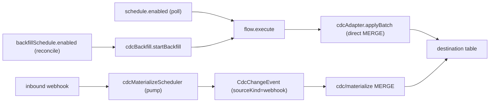

# Proposal: Unify Scheduled ("Connector Sync") and Webhook CDC Flows

> Consolidate the two flow types into a single CDC-backed sync concept where the
> **trigger** (schedule / webhook / both) and the **backfill mode** are
> orthogonal properties, not a hard-coded flow `type`. Reuse the existing schema
> fields and keep the two write paths that already exist for performance reasons.

## Summary

Mako currently exposes two conceptually-overlapping ways to sync a connector into
a destination:

1. **Scheduled flows** (`type: "scheduled"`) — cron-triggered batch pull with a
   `full | incremental` toggle, built via `ScheduledFlowForm`. Defaults to
   `syncEngine: "legacy"`.
2. **Webhook flows** (`type: "webhook"`) — push-triggered, hard-wired to
   `syncEngine: "cdc"`, with an optional periodic full backfill, built via
   `WebhookFlowForm`.

The duplication users feel is at the **trigger + form + scheduler** layer. This
proposal removes `type` as an authoritative discriminator and replaces it with
orthogonal, already-existing properties:

- **Trigger set** — derived from `schedule.enabled` (poll) and
  `webhookConfig.enabled` (push); at least one must be enabled. A sync can poll,
  receive pushes, or both.
- **Backfill mode** — the existing `syncMode: "full" | "incremental"`, plus the
  existing `backfillSchedule` for a periodic full reconcile. Independent of the
  trigger.
- **Engine** — `syncEngine: "cdc"` becomes the default for any flow with a
  CDC-capable destination; `legacy` is retained only until the Phase 5 sunset.

### Correction to the earlier framing (important)

An earlier draft claimed "the ingestion + materialization engine is already
shared and source-agnostic, so this is low-risk at the engine layer." That is
only **partly** true and must not be relied on:

- **What is genuinely shared:** the destination CDC **adapter**. Both paths
  ultimately MERGE into the same destination table via a CDC adapter
  (`hasCdcDestinationAdapter`: `bigquery | clickhouse | postgresql | mongodb`).
- **What is NOT shared (by design):** the **ingest/staging path**.
  - Webhook events go through the CDC event store:
    `cdcIngestService.appendNormalizedEvents` → `CdcChangeEvent`
    (`sourceKind: "webhook"`) → `cdc/materialize` → adapter MERGE.
  - Backfill does **not** touch the event store. It runs
    `sync-orchestrator` → `cdcAdapter.applyBatch` (direct bulk MERGE).
  - `normalizeBackfillRecord` and the `sourceKind: "backfill"` event-store branch
    exist in code but are exercised only by connector tests today, not by the
    runtime backfill path.

This dual write path is a **deliberate volume optimization**: a backfill can emit
millions of rows, and funneling each through `CdcChangeEvent` staging +
materialize would be large write amplification versus a direct MERGE. **This
proposal keeps the dual write path.** Unification happens at the
config / trigger / scheduler / UI layer and the shared adapter layer — not by
merging the two ingest paths.

---

## Motivation

### Current state (verified in code)

- Flow `type` is a hard enum discriminator, **orthogonal to** `syncEngine`:
  - `type: "scheduled" | "webhook"` — `IFlow.type`
    (`api/src/database/workspace-schema.ts` L859) + schema enum (L2065).
  - `syncEngine: "legacy" | "cdc"`, default `"legacy"`, required
    (`workspace-schema.ts` L2218).
- The two schedulers are already only partly `type`-partitioned:
  - `flowSchedulerFunction` selects `type: "scheduled"` + `schedule.enabled`
    (`api/src/inngest/functions/flow.ts` L1990).
  - `cdcScheduledBackfillFunction` selects `syncEngine: "cdc"` +
    `backfillSchedule.enabled` and **ignores `type` entirely** (`flow.ts` L2214).
- CDC provenance is real and used downstream: `CdcChangeEvent.sourceKind`
  is `["webhook", "backfill"]` (`workspace-schema.ts` L1007 / enum L2537);
  `api/src/sync-cdc/sync-state.ts` maps `sourceKind: "backfill"` →
  entity `mode: "backfill"`.
- Every connector already exposes `getWebhookCapabilities(): { supported, ... }`
  (`api/src/connectors/base/BaseConnector.ts` L333) and a canonical
  `normalizeBackfillRecord` (`BaseConnector.ts` L441).
- The backfill/sync worker is shared: `performSyncChunk` /
  `performSyncChunkSql` → `connector.fetchEntityChunk`
  (`api/src/sync/sync-orchestrator.ts`, `api/src/inngest/functions/sync-entity.ts`).
- `incremental` anchoring differs by source (see "Incremental semantics" below).

### Duplication that actually exists

| Layer | Scheduled | Webhook | Verdict |
|---|---|---|---|
| Destination adapter (MERGE) | CDC adapter (if CDC) / legacy | CDC adapter | Shared for CDC |
| Ingest/staging path | direct `applyBatch` | event store → materialize | Intentionally different |
| Flow `type` discriminator | `"scheduled"` | `"webhook"` | Duplicated (remove) |
| UI form | `ScheduledFlowForm` | `WebhookFlowForm` | Duplicated (unify) |
| Trigger scheduler | `flowSchedulerFunction` | `cdcScheduledBackfillFunction` | Overlapping selection |
| Engine exposure | legacy (UI never exposes cdc) | cdc only | Inconsistent |

### Known pain points

1. Users must decide "scheduled vs webhook" up front, even though many connectors
   want both (webhook for freshness, scheduled backfill for reconciliation).
2. Pull-only connectors that want CDC materialization (e.g. a Meta Ads connector
   writing to BigQuery/ClickHouse) have no clean UI path: `ScheduledFlowForm`
   never exposes `syncEngine: "cdc"`, and the create route forces scheduled flows
   to `legacy` (`api/src/routes/flows.ts` L720).
3. Two trigger schedulers plus a `type`-based executor guard create drift.
4. The legacy Mongo-replace engine lingers only under scheduled flows, splitting
   the destination-writer code paths.

### Desired state

- A single "Sync" object: source connector/database, CDC-capable destination,
  entity selection, backfill mode, and a **trigger set**.
- Webhook is an optional freshness trigger, never required.
- One trigger-selection model; one materialization engine (CDC); the legacy
  engine sunset separately.

---

## Architectural plan

### Data model (reuse existing fields)

No field renames. `type` is demoted to a derived, back-compat value; the
authoritative properties are already on `IFlow`:

```ts
interface IFlow {
  // Demoted: derived on write for back-compat, not read for behavior.
  // "webhook" if only webhook is enabled, else "scheduled".
  type: "scheduled" | "webhook";

  syncEngine: "legacy" | "cdc"; // "cdc" for any CDC-capable destination

  // Trigger set (already exist) — invariant: at least one enabled.
  schedule?: { enabled: boolean; cron?: string; timezone?: string };        // poll
  webhookConfig?: { enabled: boolean; secret: string; /* ... */ };          // push

  // Backfill / reconcile (already exist).
  syncMode: "full" | "incremental";                                          // reconcile strategy
  backfillSchedule?: { enabled: boolean; cron?: string; timezone?: string }; // periodic full reconcile

  // Unchanged.
  sourceType: "connector" | "database";
  dataSourceId?: ObjectId;
  destinationDatabaseId: ObjectId;
  tableDestination?: { connectionId; schema?; tableName; /* ... */ };
  entityFilter?: string[];
  entityLayouts?: IEntityLayout[];
  deleteMode?: "hard" | "soft";
}
```

Key invariants (enforced by a shared validator, not by `type`):

- At least one of `schedule.enabled` or `webhookConfig.enabled` must be true.
- `webhookConfig.enabled` requires `connector.getWebhookCapabilities().supported`
  (`api/src/connectors/base/BaseConnector.ts` L333).
- `syncEngine: "cdc"` requires a CDC-capable destination,
  `hasCdcDestinationAdapter(dest.type)`
  (`api/src/sync-cdc/adapters/registry.ts` L136).
- `schedule.cron` is required only when `schedule.enabled` (today it is gated on
  `type === "scheduled" && schedule.enabled` at `workspace-schema.ts` L2132 —
  the gate must move off `type`).
- `CdcChangeEvent.sourceKind` stays `"webhook" | "backfill"` — this is lineage
  the materializer, lag metrics, and `cdc-pending-diagnostic` depend on. Do not
  collapse it.

### Concrete engine edits (the "just remove gating" was understated)

`type` is branched in more than a scheduler filter. Each of these must change:

1. **Generalize the CDC checkpoint fan-out.** Today the checkpointed backfill is
   gated on `flow.type === "webhook"` (`flow.ts` L1176-1182). Change the gate to
   `isCdcEnabled && backfill && cdcBackfillRunId` so scheduled CDC flows also get
   checkpointed backfills. The `checkpointEnabled` plumbing in
   `sync-entity.ts` (L144-165, L334, L650) is already source-agnostic — only the
   `flow.ts` gate is `type`-specific.
2. **Rework the executor guards** (`flow.ts` L633-666):
   - `type === "webhook" && !backfill` early-return (L638) becomes "reject any
     flow reaching the executor without a schedule-or-backfill trigger."
   - Keep the "legacy webhook backfill removed" error (L655).
   - Keep forcing `syncMode = "full"` for a webhook-only backfill (L661); a
     schedule-driven incremental poll keeps its `syncMode`.
   - Mirror the same change at the chunked path (`flow.ts` L1558).
3. **Fix the create-route engine default** (`api/src/routes/flows.ts` L720):
   choose `syncEngine` by `hasCdcDestinationAdapter(destination.type)`, not by
   `flowType === "webhook"`. Legacy remains only for non-CDC destinations.
4. **Widen `flowSchedulerFunction` selection** (`flow.ts` L1990-1994): select
   `schedule.enabled` regardless of engine, then route legacy vs CDC downstream
   instead of hard-filtering `type: "scheduled"`. Remove the `type === "webhook"`
   safety check (`flow.ts` L2018) once the trigger model is authoritative.

### Scheduler model (there are four `*/5` crons, not two)

Only the first two are *triggers*; the other two must stay as-is:

- **`flowSchedulerFunction`** — poll trigger (`schedule.enabled`). Emits
  `flow.execute`.
- **`cdcScheduledBackfillFunction`** — periodic full-reconcile trigger
  (`backfillSchedule.enabled`, already `type`-agnostic). Calls
  `cdcBackfillService.startBackfill` → `flow.execute`.
- **`cdcMaterializeSchedulerFunction`** — a materialization **pump** for the
  webhook event store (`WebhookEvent` → `CdcChangeEvent` → `cdc/materialize`).
  Not a trigger; leave unchanged.
- **`cleanupAbandonedFlowsFunction`** — recovery cron (re-triggers stuck CDC
  backfills). Not a trigger; leave unchanged.

Note: all schedulers only register when `NODE_ENV === "production"` and
`DISABLE_SCHEDULED_SYNC !== "true"` (`api/src/inngest/index.ts`).

"Scheduler consolidation" therefore means: make the two trigger selections
engine/trigger-based rather than `type`-partitioned, keeping Inngest event names
stable. It does **not** mean collapsing the pump or recovery crons.



### Incremental semantics (unchanged, but must be documented)

`syncMode: "incremental"` resolves differently by source; the unified model does
not change these, but validation/UX must respect them:

- **Connector source:** `sync-orchestrator` anchors on `max(_syncedAt)` in the
  destination (Mongo collection or SQL table) and passes it as `since`.
- **Database (SQL) source:** anchors on `incrementalConfig.trackingColumn` +
  `incrementalConfig.lastValue` stored on the flow.
- **Webhook backfill:** `flowFunction` forces `syncMode = "full"`.
- **Restated data (e.g. Meta Ads insights):** incremental-by-`since` is
  insufficient; the connector must extend `since` internally and re-fetch a
  trailing window. This stays a connector responsibility.

---

## Migration plan (phased, flag-gated, reversible)

Ship behind a `unifiedSyncFlows` feature flag. Because we reuse existing fields
and keep `type` authoritative until Phase 3, the flag is a clean rollback.

### Phase 0 — Validation + derivation (no user-visible change)

- Add a shared read-side helper that derives the trigger set and effective engine
  from existing fields (`schedule.enabled`, `webhookConfig.enabled`,
  `syncEngine`, destination capability).
- Extend the schema validator so `schedule.cron` is required when
  `schedule.enabled` **independent of `type`** (`workspace-schema.ts` L2132).
- No writes change; everything still runs on `type`.

### Phase 1 — Engine convergence (behind flag)

- Land the four engine edits above. Gate scheduled → CDC on
  `hasCdcDestinationAdapter`. Legacy Mongo scheduled flows stay on the legacy
  path.

### Phase 2 — Data migration (idempotent, reversible)

- Add a migration under `api/src/migrations/**` (see
  `.cursor/skills/create-migration`) that normalizes invariants on existing
  flows: ensure ≥1 enabled trigger; set `syncEngine` from destination capability
  where safe. No structural rename, since fields are reused.
- `up` is idempotent; `down` reverts the normalized `syncEngine`/trigger flags.

### Phase 3 — UI cutover (behind flag)

- Ship the unified `SyncFlowForm`; keep `ScheduledFlowForm` / `WebhookFlowForm`
  as fallbacks when the flag is off.
- New syncs still write a derived `type` for back-compat (`webhook` if only
  webhook enabled, else `scheduled`).

### Phase 4 — Scheduler consolidation

- Replace the two `type`-partitioned trigger selections with engine/trigger-based
  selections. Keep Inngest event names stable to avoid churn.

### Phase 5 — Legacy sunset (separate, opt-in)

- Migrate remaining `syncEngine: "legacy"` scheduled flows to CDC + a
  CDC-capable destination (requires a destination for Mongo-only users).
- Once drained, remove the legacy Mongo-replace destination path and the `type`
  discriminator entirely.

### Rollback

- Phases 0–3 keep legacy fields authoritative and only *derive* the new shape;
  disabling the flag reverts behavior. The Phase 2 migration is `down`-reversible.

---

## UX plan

### Single "Sync" builder

Replace two forms with one wizard, composed from the already-validated
`WebhookFlowForm` sub-components (destination selector, entity layout editor,
webhook secret / provisioning block, cron editor) so we reuse validated pieces:

1. **Source** — pick connector (or database). Unchanged.
2. **Destination** — pick a CDC-capable destination + schema/dataset (same field
   set `WebhookFlowForm` already enforces).
3. **Triggers** — a multi-select, not an either/or:
   - `☑ Scheduled` → cron + timezone (incremental poll cadence).
   - `☑ Webhook` → shown only if
     `connector.getWebhookCapabilities().supported`; renders the existing secret
     / provisioning UI. Greyed out with a tooltip for pull-only connectors
     ("This connector does not provide webhooks — use a schedule").
   - Validation: at least one enabled.
4. **Backfill / Reconcile** — `full | incremental` reconcile mode + optional
   periodic full-reconcile cron (maps to `backfillSchedule`).
5. **Entities** — entity selection + layout hints. Unchanged.

### Trigger matrix surfaced to the user

- **Push-capable connectors (Close, Stripe, Calendly, PandaDoc, Claap):** default
  to webhook + scheduled full reconcile; backfill mode `full`.
- **Pull-only connectors (Meta Ads, REST, GraphQL):** default to scheduled;
  backfill mode `incremental` (with a connector-managed trailing window for
  restated data).
- **Hybrid:** both triggers; incremental poll + periodic full reconcile.

### Component plan

- New `app/src/components/SyncFlowForm.tsx` composed from existing sub-components;
  no full rewrite.
- Keep the schema-driven connector-agnostic rules: no `if (type === "meta-ads")`
  branching; the webhook step is gated purely on
  `getWebhookCapabilities().supported`.
- `app/src/components/BackfillPanel.tsx` is the CDC operations dashboard for an
  existing flow — it works unchanged once scheduled flows can be CDC.

### Wireframe (textual)

```
┌ New Sync ───────────────────────────────────────────────┐
│ 1 Source        [ Meta Ads ▼ ]                           │
│ 2 Destination   [ BigQuery ▼ ]  schema [ marketing ]     │
│ 3 Triggers      [x] Scheduled   cron [0 * * * *] TZ[UTC] │
│                 [ ] Webhook     (unavailable for Meta Ads)│
│ 4 Backfill      ( ) Full   (•) Incremental               │
│                 [ ] Periodic full reconcile  cron[0 3 * * *]│
│ 5 Entities      [x] campaigns [x] ads [x] ads_insights…  │
└──────────────────────────────────────────────────────────┘
```

---

## Risks & open questions

- **Legacy engine sunset** is the largest lift: Mongo-only scheduled flows need a
  CDC-capable destination before `type`/legacy removal (Phase 5). Until then, the
  two engines coexist.
- **Checkpoint generalization** (`flow.ts` L1176) is a real engine change, not a
  gate deletion: scheduled CDC backfills must exercise the same checkpointed
  fan-out that only webhook backfills use today.
- **Provenance stays split**: do not collapse `sourceKind` — the materializer,
  lag metrics, and `cdc-pending-diagnostic` rely on `webhook` vs `backfill`.
- **Dual write path stays split**: this is intentional (backfill volume). Do not
  route backfill through `appendNormalizedEvents`.
- **Testing without cron**: schedulers only register in production
  (`NODE_ENV === "production"`, `DISABLE_SCHEDULED_SYNC !== "true"` —
  `api/src/inngest/index.ts`). Engine-phase testing should send `flow.execute`
  manually (or via `flow.manual`) and unit-test the selection queries rather than
  waiting on cron.
- **Open question**: single flow with a trigger set, or one flow per trigger?
  Recommendation: single flow, trigger set — it matches the shared adapter and
  avoids fan-out of destination config.

---

## Appendix: primary code references (verified)

- Flow model: `api/src/database/workspace-schema.ts` — `IFlow` (L856-935),
  `type` enum (L2065), `syncEngine` enum (L2218), `schedule` (L2127),
  `backfillSchedule` (L2154), `webhookConfig` (L2176); `ICdcChangeEvent` (L1002)
  + `sourceKind` enum (L2537); `IWebhookEvent` (L968).
- Schedulers + executor guards: `api/src/inngest/functions/flow.ts` —
  `flowSchedulerFunction` (L1990), scheduled safety check (L2018),
  `cdcScheduledBackfillFunction` (L2214), executor guards (L633-666, L1558),
  checkpoint fan-out gate (L1176-1182).
- Materialize pump + webhook ingest: `api/src/inngest/functions/webhook-flow.ts`
  (`cdcMaterializeSchedulerFunction`, `ingestPendingWebhookEvents`).
- Shared worker: `api/src/sync/sync-orchestrator.ts`
  (`performSyncChunk`, `performSyncChunkSql`, `isCdcEnabled`),
  `api/src/inngest/functions/sync-entity.ts` (`checkpointEnabled` plumbing).
- CDC ingest/state/store: `api/src/sync-cdc/ingest.ts`
  (`appendNormalizedEvents` — webhook path only in runtime),
  `api/src/sync-cdc/sync-state.ts` (`sourceKind → mode` map),
  `api/src/sync-cdc/event-store.ts`, `api/src/sync-cdc/adapters/registry.ts`
  (`hasCdcDestinationAdapter` L136).
- Backfill write path: `api/src/sync-cdc/backfill.ts` (`startBackfill`),
  `cdcAdapter.applyBatch` (direct MERGE, not the event store).
- Connector capabilities/normalization: `api/src/connectors/base/BaseConnector.ts`
  (`getWebhookCapabilities` L333, `normalizeBackfillRecord` L441).
- Create/engine defaults + routes: `api/src/routes/flows.ts`
  (`syncEngine` default L720; create `POST /api/workspaces/:workspaceId/flows`,
  update `PUT .../flows/:flowId`, `POST .../flows/:flowId/sync-engine`).
- Forms: `app/src/components/ScheduledFlowForm.tsx`,
  `app/src/components/WebhookFlowForm.tsx`, `app/src/components/BackfillPanel.tsx`.
